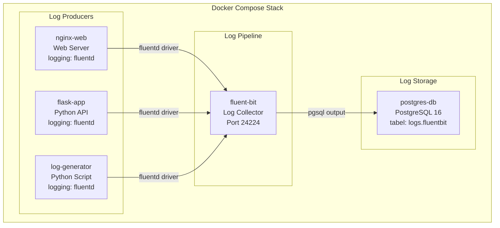

# MODUL 5: Logging Service Docker dengan PostgreSQL

**Topik:** Centralized Logging dengan Fluent Bit, PostgreSQL sebagai Log Storage, dan Log Analysis  
**Durasi:** 120 menit  
**Prasyarat:** Modul 4 selesai (PostgreSQL running di Docker, memahami volume dan compose)

---

## 1. TUJUAN PEMBELAJARAN

Setelah praktikum ini, mahasiswa mampu:

1. Memahami arsitektur centralized logging di lingkungan container
2. Men-deploy Fluent Bit sebagai log collector dan forwarder dalam Docker
3. Mengkonfigurasi Docker logging driver untuk mengirim log ke Fluent Bit
4. Menyimpan log dari semua container ke PostgreSQL secara terpusat
5. Membuat Python log generator untuk mensimulasikan log aplikasi
6. Melakukan query dan analisis log menggunakan SQL dan JSONB di PostgreSQL
7. Mengimplementasikan log retention policy
8. Mengorkestrasi seluruh stack logging dengan Docker Compose

---

## 2. DASAR TEORI

### 2.1 Pentingnya Centralized Logging

Di lingkungan container, service bisa berjumlah banyak dan bersifat ephemeral (dibuat dan dihapus secara dinamis). Log tersebar di masing-masing container menyulitkan debugging dan audit. **Centralized logging** mengumpulkan semua log ke satu tempat, memudahkan pencarian, analisis, dan alerting.

### 2.2 Arsitektur Logging

```
┌───────────────┐  ┌───────────────┐  ┌───────────────┐
│  Container A  │  │  Container B  │  │  Container C  │
│  (web server) │  │  (flask app)  │  │  (worker)     │
│  stdout/stderr│  │  stdout/stderr│  │  stdout/stderr│
└───────┬───────┘  └───────┬───────┘  └───────┬───────┘
        │                  │                  │
        └──────────────────┼──────────────────┘
                           │ Docker Fluentd
                           │ logging driver
                    ┌──────▼──────┐
                    │  Fluent Bit │
                    │  (Collector │
                    │  & Parser)  │
                    └──────┬──────┘
                           │ pgsql plugin
                    ┌──────▼──────┐
                    │ PostgreSQL  │
                    │ (Log Store) │
                    └─────────────┘
```

### 2.3 Fluent Bit vs Fluentd

| Aspek | Fluent Bit | Fluentd |
|---|---|---|
| Bahasa | C | Ruby + C |
| Memory | ~1 MB | ~40 MB |
| Plugin | Built-in essentials | 1000+ plugin ecosystem |
| Use Case | Edge/sidecar collector | Aggregator/forwarder |
| Docker Image | `fluent/fluent-bit` | `fluent/fluentd` |

Praktikum ini menggunakan **Fluent Bit** karena ringan dan cocok untuk skenario lab.

### 2.4 Docker Logging Driver

Docker mendukung beberapa logging driver. Default-nya adalah `json-file` yang menyimpan log ke file JSON di host. Untuk centralized logging, kita bisa menggunakan driver `fluentd` yang mengirim log langsung ke Fluent Bit/Fluentd.

| Driver | Deskripsi |
|---|---|
| `json-file` | Default, simpan ke file JSON |
| `syslog` | Kirim ke syslog daemon |
| `fluentd` | Kirim ke Fluentd/Fluent Bit |
| `journald` | Kirim ke systemd journal |
| `none` | Buang semua log |

### 2.5 Fluent Bit PostgreSQL Plugin — Struktur Data

**Penting:** Fluent Bit `pgsql` output plugin menyimpan data dalam format fixed 3 kolom:

| Kolom | Tipe | Isi |
|---|---|---|
| `tag` | `varchar` | Tag Fluent Bit (misal: `docker.nginx`, `docker.flask`) |
| `time` | `timestamp` | Waktu log diterima |
| `data` | `jsonb` | Seluruh isi log record sebagai JSON |

Semua informasi log (container name, message, level, dll.) tersimpan di dalam kolom `data` sebagai **JSONB**. Untuk mengekstrak field tertentu, kita gunakan operator JSONB PostgreSQL: `data->>'field_name'`.

```
Contoh isi kolom "data":
{
  "container_name": "/nginx-web",
  "container_id": "a1b2c3d4...",
  "source": "stdout",
  "log": "{\"timestamp\":\"2025-05-11\",\"level\":\"INFO\",\"message\":\"Request GET /\"}"
}
```

---

## 3. TOPOLOGI LAB



---

## 4. LANGKAH PRAKTIKUM

### Langkah 0: Persiapan Project

```bash
mkdir -p ~/docker-lab/logging/{fluent-bit,app,generator,init}
cd ~/docker-lab/logging
```

---

### Langkah 1: Buat Database Schema untuk Logging

Tabel utama menggunakan struktur yang **sesuai** dengan Fluent Bit `pgsql` plugin (3 kolom: `tag`, `time`, `data`). View digunakan untuk menyajikan data dalam format yang mudah dibaca.

```bash
cat > init/01-logging-schema.sql << 'EOF'
-- ==============================================
-- Schema untuk Centralized Logging
-- ==============================================
-- PENTING: Fluent Bit pgsql plugin INSERT ke kolom:
--   tag (varchar), time (timestamp), data (jsonb)
-- Jangan ubah nama kolom ini — harus persis sesuai plugin.
-- ==============================================

CREATE SCHEMA IF NOT EXISTS logs;

-- Tabel utama: format sesuai Fluent Bit pgsql plugin
CREATE TABLE logs.fluentbit (
    id       BIGSERIAL PRIMARY KEY,
    tag      VARCHAR(200),
    time     TIMESTAMP,
    data     JSONB
);

-- Index untuk performa query
CREATE INDEX idx_fb_time ON logs.fluentbit(time);
CREATE INDEX idx_fb_tag  ON logs.fluentbit(tag);
CREATE INDEX idx_fb_data ON logs.fluentbit USING GIN(data);

-- ==============================================
-- VIEWS: Parsing JSONB ke format readable
-- ==============================================

-- View: semua log dengan field diekstrak dari JSONB
CREATE OR REPLACE VIEW logs.parsed_logs AS
SELECT
    id,
    tag,
    time AS received_at,
    -- Container info (diisi oleh Docker fluentd driver)
    REPLACE(data->>'container_name', '/', '') AS container_name,
    LEFT(data->>'container_id', 12)           AS container_id,
    data->>'source'                           AS source,
    -- Isi log (bisa plain text atau JSON)
    data->>'log'                              AS raw_log,
    -- Jika log berbentuk JSON, ekstrak level dan message
    CASE
        WHEN (data->>'log')::jsonb IS NOT NULL
        THEN (data->>'log')::jsonb->>'level'
        ELSE NULL
    END AS log_level,
    CASE
        WHEN (data->>'log')::jsonb IS NOT NULL
        THEN (data->>'log')::jsonb->>'message'
        ELSE data->>'log'
    END AS message
FROM logs.fluentbit
ORDER BY time DESC;

-- View: log terbaru (100 entry)
CREATE OR REPLACE VIEW logs.recent_logs AS
SELECT
    id,
    to_char(time, 'YYYY-MM-DD HH24:MI:SS') AS time,
    tag,
    REPLACE(data->>'container_name', '/', '') AS container,
    data->>'source' AS source,
    LEFT(data->>'log', 200) AS log_preview
FROM logs.fluentbit
ORDER BY time DESC
LIMIT 100;

-- View: log yang berisi JSON — parsed level dan message
-- (untuk log-generator dan flask yang output structured JSON)
CREATE OR REPLACE VIEW logs.structured_logs AS
SELECT
    id,
    time AS received_at,
    tag,
    REPLACE(data->>'container_name', '/', '') AS container_name,
    (data->>'log')::jsonb->>'level'           AS log_level,
    (data->>'log')::jsonb->>'message'         AS message,
    (data->>'log')::jsonb->>'hostname'        AS hostname,
    (data->>'log')::jsonb->>'service'         AS service
FROM logs.fluentbit
WHERE data->>'log' IS NOT NULL
  AND LEFT(TRIM(data->>'log'), 1) = '{'
ORDER BY time DESC;

-- View: error summary per container
CREATE OR REPLACE VIEW logs.error_summary AS
SELECT
    REPLACE(data->>'container_name', '/', '') AS container_name,
    (data->>'log')::jsonb->>'level'           AS log_level,
    COUNT(*)                                  AS count,
    MAX(time)                                 AS last_seen
FROM logs.fluentbit
WHERE data->>'log' IS NOT NULL
  AND LEFT(TRIM(data->>'log'), 1) = '{'
  AND (data->>'log')::jsonb->>'level' IN ('ERROR', 'WARN', 'CRITICAL')
GROUP BY 1, 2
ORDER BY count DESC;

-- Fungsi: cleanup log > 30 hari
CREATE OR REPLACE FUNCTION logs.cleanup_old_logs()
RETURNS INTEGER AS $$
DECLARE
    deleted_count INTEGER;
BEGIN
    DELETE FROM logs.fluentbit
    WHERE time < NOW() - INTERVAL '30 days';
    GET DIAGNOSTICS deleted_count = ROW_COUNT;
    RETURN deleted_count;
END;
$$ LANGUAGE plpgsql;

RAISE NOTICE 'Logging schema created successfully!';
EOF
```

**Penjelasan Desain:**
- Tabel `logs.fluentbit` mengikuti persis schema yang diharapkan plugin `pgsql` Fluent Bit (tag, time, data).
- Semua informasi tersimpan di kolom `data` (JSONB).
- View `parsed_logs` dan `structured_logs` mengekstrak field dari JSONB, sehingga query menjadi mudah dibaca.
- View `structured_logs` hanya menampilkan log yang berformat JSON (dari log-generator dan flask), bukan plain text (dari nginx).

---

### Langkah 2: Konfigurasi Fluent Bit

```bash
cat > fluent-bit/fluent-bit.conf << 'EOF'
[SERVICE]
    Flush        5
    Daemon       Off
    Log_Level    info
    Parsers_File parsers.conf

# Terima log dari Docker fluentd logging driver
[INPUT]
    Name         forward
    Listen       0.0.0.0
    Port         24224

# Simpan ke PostgreSQL
# Plugin pgsql INSERT ke kolom: tag, time, data (jsonb)
[OUTPUT]
    Name          pgsql
    Match         *
    Host          postgres-db
    Port          5432
    User          labuser
    Password      labpass123
    Database      labdb
    Table         fluentbit
    Schema        logs
    Timestamp_Key time
    Async         false
    min_pool_size 1
    max_pool_size 4

# Juga print ke stdout (untuk debugging via docker compose logs)
[OUTPUT]
    Name          stdout
    Match         *
    Format        json_lines
EOF

cat > fluent-bit/parsers.conf << 'EOF'
[PARSER]
    Name         docker
    Format       json
    Time_Key     time
    Time_Format  %Y-%m-%dT%H:%M:%S.%L
    Time_Keep    On
EOF
```

**Perhatikan perbedaan dari versi sebelumnya:**
- Filter `parser` dan `modify` **dihapus** — filter ini menyebabkan field di-rename sehingga plugin `pgsql` tidak mengenali struktur data dan INSERT gagal diam-diam.
- `Match` menggunakan `*` (wildcard) agar semua tag ter-capture.
- `Table` diisi `fluentbit` (bukan `container_logs`) sesuai nama tabel yang kita buat.

---

### Langkah 3: Buat Log Generator (Simulasi Multi-Level Log)

```bash
cat > generator/generator.py << 'PYEOF'
"""
Log Generator — mensimulasikan log dari aplikasi production.
Menghasilkan log JSON ke stdout. Docker fluentd driver menangkap
dan mengirim ke Fluent Bit → PostgreSQL.
"""
import json, time, random, socket, datetime, os

HOSTNAME = socket.gethostname()
LOG_INTERVAL = float(os.environ.get("LOG_INTERVAL", "2"))

EVENTS = [
    {"level": "INFO",     "weight": 50, "messages": [
        "User login successful",
        "Page /dashboard loaded in {ms}ms",
        "API request GET /api/users completed",
        "Session created for user_{uid}",
        "Cache hit for key: product_{pid}",
        "Health check passed",
        "Background job completed: email_send"
    ]},
    {"level": "DEBUG",    "weight": 20, "messages": [
        "Database query executed in {ms}ms",
        "Redis connection pool: {pool} active",
        "Request headers: content-type=application/json",
        "Middleware chain completed in {ms}ms"
    ]},
    {"level": "WARN",     "weight": 15, "messages": [
        "Slow query detected: {ms}ms (threshold: 1000ms)",
        "Memory usage at {mem}% — approaching limit",
        "Rate limit approaching for IP 192.168.{ip}.{host}",
        "Deprecated API endpoint called: /api/v1/legacy",
        "Certificate expires in {days} days"
    ]},
    {"level": "ERROR",    "weight": 10, "messages": [
        "Failed to connect to database: timeout after 5s",
        "NullPointerException in UserService.getProfile()",
        "HTTP 500 Internal Server Error on /api/checkout",
        "Disk write failed: /var/log/app.log — Permission denied",
        "Payment gateway returned error code {code}"
    ]},
    {"level": "CRITICAL", "weight": 5,  "messages": [
        "Database connection pool exhausted — all {pool} connections in use",
        "Out of memory: container killed by OOM",
        "SSL certificate EXPIRED — HTTPS unavailable",
        "Data corruption detected in table: orders"
    ]}
]

def weighted_choice():
    total = sum(e["weight"] for e in EVENTS)
    r = random.uniform(0, total)
    cumulative = 0
    for event in EVENTS:
        cumulative += event["weight"]
        if r <= cumulative:
            return event
    return EVENTS[0]

def generate_log():
    event = weighted_choice()
    msg = random.choice(event["messages"])
    msg = msg.format(
        ms=random.randint(5, 3000),
        uid=random.randint(1000, 9999),
        pid=random.randint(1, 500),
        pool=random.randint(1, 50),
        mem=random.randint(60, 98),
        ip=random.randint(1, 254),
        host=random.randint(1, 254),
        days=random.randint(1, 30),
        code=random.choice([400, 401, 403, 500, 502, 503])
    )

    log_entry = {
        "timestamp": datetime.datetime.now().isoformat(),
        "level": event["level"],
        "hostname": HOSTNAME,
        "service": "log-generator",
        "message": msg,
        "request_id": f"req-{random.randint(100000, 999999)}"
    }

    # Output sebagai JSON ke stdout → Docker fluentd driver menangkap
    print(json.dumps(log_entry), flush=True)

if __name__ == "__main__":
    print(json.dumps({
        "timestamp": datetime.datetime.now().isoformat(),
        "level": "INFO",
        "hostname": HOSTNAME,
        "service": "log-generator",
        "message": f"Log generator started, interval={LOG_INTERVAL}s"
    }), flush=True)

    while True:
        generate_log()
        time.sleep(LOG_INTERVAL + random.uniform(-0.5, 0.5))
PYEOF

cat > generator/Dockerfile << 'EOF'
FROM python:3.11-alpine
WORKDIR /app
COPY generator.py .
CMD ["python", "-u", "generator.py"]
EOF
```

---

### Langkah 4: Buat Flask App dengan Structured Logging + Log Query API

```bash
cat > app/requirements.txt << 'EOF'
flask==3.1.*
psycopg2-binary==2.9.*
EOF

cat > app/app.py << 'PYEOF'
"""
Flask App — Structured JSON logging ke stdout + API untuk query log.
Log yang keluar ke stdout ditangkap oleh Docker fluentd driver
→ Fluent Bit → PostgreSQL.
"""
import os, json, socket, datetime, logging, sys
from flask import Flask, jsonify, request
import psycopg2

app = Flask(__name__)

# === Structured JSON logging ke stdout ===
class JSONFormatter(logging.Formatter):
    def format(self, record):
        return json.dumps({
            "timestamp": datetime.datetime.now().isoformat(),
            "level": record.levelname,
            "hostname": socket.gethostname(),
            "service": "flask-app",
            "message": record.getMessage(),
            "module": record.module
        })

handler = logging.StreamHandler(sys.stdout)
handler.setFormatter(JSONFormatter())
app.logger.handlers = [handler]
app.logger.setLevel(logging.INFO)
# Matikan default Flask/Werkzeug logger agar tidak double-log
logging.getLogger("werkzeug").setLevel(logging.WARNING)

DB = dict(
    host=os.environ.get("DB_HOST", "postgres-db"),
    dbname=os.environ.get("DB_NAME", "labdb"),
    user=os.environ.get("DB_USER", "labuser"),
    password=os.environ.get("DB_PASS", "labpass123")
)

def get_db():
    return psycopg2.connect(**DB)

# === ROUTES ===

@app.route("/")
def index():
    app.logger.info(f"Index accessed from {request.remote_addr}")
    return jsonify({
        "service": "flask-app",
        "status": "running",
        "hostname": socket.gethostname()
    })

@app.route("/api/logs/stats")
def log_stats():
    """Statistik log dari PostgreSQL — menggunakan JSONB query."""
    try:
        conn = get_db(); cur = conn.cursor()

        # Total log
        cur.execute("SELECT COUNT(*) FROM logs.fluentbit")
        total = cur.fetchone()[0]

        # Distribusi per tag (= per container group)
        cur.execute("""
            SELECT tag, COUNT(*) AS count
            FROM logs.fluentbit
            WHERE time > NOW() - INTERVAL '1 hour'
            GROUP BY tag ORDER BY count DESC
        """)
        by_tag = [{"tag": r[0], "count": r[1]} for r in cur.fetchall()]

        # Distribusi per level (hanya dari structured JSON logs)
        cur.execute("""
            SELECT
                (data->>'log')::jsonb->>'level' AS level,
                COUNT(*) AS count
            FROM logs.fluentbit
            WHERE time > NOW() - INTERVAL '1 hour'
              AND data->>'log' IS NOT NULL
              AND LEFT(TRIM(data->>'log'), 1) = '{'
            GROUP BY level
            ORDER BY count DESC
        """)
        by_level = [{"level": r[0], "count": r[1]} for r in cur.fetchall()]

        cur.close(); conn.close()
        return jsonify({
            "total_logs_all_time": total,
            "last_hour_by_tag": by_tag,
            "last_hour_by_level": by_level
        })
    except Exception as e:
        app.logger.error(f"Failed to query log stats: {e}")
        return jsonify({"error": str(e)}), 500

@app.route("/api/logs/search")
def log_search():
    """Cari log berdasarkan keyword, level, atau tag."""
    keyword = request.args.get("q", "")
    level   = request.args.get("level", "")
    tag     = request.args.get("tag", "")
    limit   = min(int(request.args.get("limit", 50)), 200)

    try:
        conn = get_db(); cur = conn.cursor()

        # Query dari view structured_logs (hanya JSON logs)
        query = """
            SELECT id, received_at, tag, container_name,
                   log_level, message, service
            FROM logs.structured_logs
            WHERE 1=1
        """
        params = []

        if keyword:
            query += " AND message ILIKE %s"
            params.append(f"%{keyword}%")
        if level:
            query += " AND log_level = %s"
            params.append(level.upper())
        if tag:
            query += " AND tag ILIKE %s"
            params.append(f"%{tag}%")

        query += " ORDER BY received_at DESC LIMIT %s"
        params.append(limit)

        cur.execute(query, params)
        logs = [{
            "id": r[0], "time": str(r[1]), "tag": r[2],
            "container": r[3], "level": r[4],
            "message": r[5], "service": r[6]
        } for r in cur.fetchall()]

        cur.close(); conn.close()
        return jsonify({"count": len(logs), "results": logs})
    except Exception as e:
        app.logger.error(f"Log search error: {e}")
        return jsonify({"error": str(e)}), 500

@app.route("/api/logs/raw")
def log_raw():
    """Lihat raw log entries (termasuk Nginx plain text)."""
    limit = min(int(request.args.get("limit", 20)), 100)
    try:
        conn = get_db(); cur = conn.cursor()
        cur.execute("""
            SELECT id, time, tag,
                   REPLACE(data->>'container_name', '/', '') AS container,
                   data->>'source' AS source,
                   LEFT(data->>'log', 300) AS log_content
            FROM logs.fluentbit
            ORDER BY time DESC LIMIT %s
        """, (limit,))
        logs = [{
            "id": r[0], "time": str(r[1]), "tag": r[2],
            "container": r[3], "source": r[4], "log": r[5]
        } for r in cur.fetchall()]
        cur.close(); conn.close()
        return jsonify({"count": len(logs), "results": logs})
    except Exception as e:
        return jsonify({"error": str(e)}), 500

if __name__ == "__main__":
    app.run(host="0.0.0.0", port=5000)
PYEOF

cat > app/Dockerfile << 'EOF'
FROM python:3.11-slim
WORKDIR /app
COPY requirements.txt .
RUN pip install --no-cache-dir -r requirements.txt
COPY app.py .
EXPOSE 5000
CMD ["python", "-u", "app.py"]
EOF
```

---

### Langkah 5: Docker Compose untuk Stack Logging

```bash
cat > docker-compose.yml << 'EOF'
services:

  # ============================================
  # LOG STORAGE: PostgreSQL (start pertama)
  # ============================================
  postgres-db:
    image: postgres:16-alpine
    container_name: postgres-db
    environment:
      POSTGRES_DB: labdb
      POSTGRES_USER: labuser
      POSTGRES_PASSWORD: labpass123
      TZ: Asia/Jakarta
    ports:
      - "5432:5432"
    volumes:
      - pg-data:/var/lib/postgresql/data
      - ./init:/docker-entrypoint-initdb.d:ro
    networks:
      - logging-net
    healthcheck:
      test: ["CMD-SHELL", "pg_isready -U labuser -d labdb"]
      interval: 5s
      timeout: 3s
      retries: 10
    restart: unless-stopped

  # ============================================
  # LOG COLLECTOR: Fluent Bit (start setelah DB ready)
  # ============================================
  fluent-bit:
    image: fluent/fluent-bit:latest
    container_name: fluent-bit
    ports:
      - "24224:24224"
      - "24224:24224/udp"
    volumes:
      - ./fluent-bit/fluent-bit.conf:/fluent-bit/etc/fluent-bit.conf:ro
      - ./fluent-bit/parsers.conf:/fluent-bit/etc/parsers.conf:ro
    networks:
      - logging-net
    depends_on:
      postgres-db:
        condition: service_healthy
    restart: unless-stopped

  # ============================================
  # LOG PRODUCERS
  # ============================================

  # --- Nginx: menghasilkan plain text access log ---
  nginx-web:
    image: nginx:alpine
    container_name: nginx-web
    ports:
      - "8080:80"
    networks:
      - logging-net
    logging:
      driver: fluentd
      options:
        fluentd-address: "localhost:24224"
        fluentd-async: "true"
        tag: "docker.nginx"
    depends_on:
      - fluent-bit
    restart: unless-stopped

  # --- Flask App: menghasilkan structured JSON log ---
  flask-app:
    build: ./app
    container_name: flask-app
    environment:
      - DB_HOST=postgres-db
      - DB_NAME=labdb
      - DB_USER=labuser
      - DB_PASS=labpass123
    ports:
      - "5000:5000"
    networks:
      - logging-net
    logging:
      driver: fluentd
      options:
        fluentd-address: "localhost:24224"
        fluentd-async: "true"
        tag: "docker.flask"
    depends_on:
      - fluent-bit
      - postgres-db
    restart: unless-stopped

  # --- Log Generator: menghasilkan structured JSON log multi-level ---
  log-generator:
    build: ./generator
    container_name: log-generator
    environment:
      - LOG_INTERVAL=3
    networks:
      - logging-net
    logging:
      driver: fluentd
      options:
        fluentd-address: "localhost:24224"
        fluentd-async: "true"
        tag: "docker.generator"
    depends_on:
      - fluent-bit
    restart: unless-stopped

volumes:
  pg-data:

networks:
  logging-net:
EOF
```

---

### Langkah 6: Deploy dan Verifikasi

#### 6.1 Pastikan environment bersih

```bash
cd ~/docker-lab/logging

# Jika pernah deploy sebelumnya, bersihkan total (termasuk volume)
docker compose down -v 2>/dev/null

# Build dan jalankan
docker compose up --build -d
```

#### 6.2 Verifikasi urutan startup

```bash
# Cek semua service
docker compose ps

# Cek Fluent Bit sudah connect ke PostgreSQL
docker compose logs fluent-bit 2>&1 | tail -10
# Cari: "[output:pgsql:pgsql.0] host=postgres-db port=5432 ..."
# TIDAK BOLEH ada error "connection refused" atau "relation does not exist"
```

**Jika ada error di Fluent Bit:**
```bash
# Debug: cek apakah tabel sudah ada
docker exec postgres-db psql -U labuser -d labdb -c "\dt logs.*"
# Harus tampil: logs.fluentbit

# Jika tabel belum ada, init script tidak jalan (volume lama masih ada)
docker compose down -v
docker compose up --build -d
```

#### 6.3 Tunggu log terkumpul dan generate traffic

```bash
# Tunggu ~30 detik agar log-generator menghasilkan log
sleep 30

# Generate traffic ke Nginx
for i in $(seq 1 20); do curl -s http://localhost:8080 > /dev/null; done

# Generate traffic ke Flask
for i in $(seq 1 10); do curl -s http://localhost:5000/ > /dev/null; done

# Tunggu flush (Fluent Bit flush setiap 5 detik)
sleep 10
```

#### 6.4 Verifikasi log masuk ke PostgreSQL

```bash
docker exec -it postgres-db psql -U labuser -d labdb << 'SQLEOF'

-- ============================================
-- CEK 1: Apakah log masuk?
-- ============================================
SELECT COUNT(*) AS total_logs FROM logs.fluentbit;
-- Harus > 0. Jika 0, ada masalah koneksi Fluent Bit → PostgreSQL.

-- ============================================
-- CEK 2: Lihat raw data (3 kolom: tag, time, data)
-- ============================================
SELECT tag, time, LEFT(data::text, 120) AS data_preview
FROM logs.fluentbit
ORDER BY time DESC LIMIT 5;

-- ============================================
-- CEK 3: Lihat log terbaru via view
-- ============================================
SELECT * FROM logs.recent_logs LIMIT 10;

-- ============================================
-- CEK 4: Lihat structured logs (JSON parsed)
-- ============================================
SELECT * FROM logs.structured_logs LIMIT 10;

SQLEOF
```

**Expected output untuk CEK 2:**
```
     tag        |           time            |   data_preview
----------------+---------------------------+--------------------------------------------------
 docker.generator | 2025-05-11 10:30:15.123 | {"log": "{\"timestamp\":\"2025-05-11\",\"level\":
 docker.nginx     | 2025-05-11 10:30:14.456 | {"log": "172.20.0.1 - - [11/May/2025:10:30:14 ...
 docker.flask     | 2025-05-11 10:30:12.789 | {"log": "{\"timestamp\":\"2025-05-11\",\"level\":
```

#### 6.5 Query analisis log

```bash
docker exec -it postgres-db psql -U labuser -d labdb << 'SQLEOF'

-- Distribusi log per tag (= per container group)
SELECT tag, COUNT(*) AS total
FROM logs.fluentbit
GROUP BY tag ORDER BY total DESC;

-- Distribusi per level (hanya structured JSON logs)
SELECT log_level, COUNT(*) AS total
FROM logs.structured_logs
GROUP BY log_level ORDER BY total DESC;

-- Error summary per container
SELECT * FROM logs.error_summary;

-- Cari log ERROR dalam 1 jam terakhir
SELECT received_at, container_name, log_level, message
FROM logs.structured_logs
WHERE log_level = 'ERROR'
  AND received_at > NOW() - INTERVAL '1 hour'
ORDER BY received_at DESC LIMIT 10;

-- Log rate per menit (5 menit terakhir)
SELECT
    date_trunc('minute', time) AS minute,
    COUNT(*) AS logs_per_minute
FROM logs.fluentbit
WHERE time > NOW() - INTERVAL '5 minutes'
GROUP BY minute ORDER BY minute;

-- Cari keyword "timeout" di semua log
SELECT received_at, container_name, log_level, message
FROM logs.structured_logs
WHERE message ILIKE '%timeout%'
ORDER BY received_at DESC LIMIT 5;

-- Nginx access log (plain text — bukan JSON)
SELECT time, LEFT(data->>'log', 150) AS access_log
FROM logs.fluentbit
WHERE tag = 'docker.nginx'
ORDER BY time DESC LIMIT 10;

SQLEOF
```

#### 6.6 Gunakan Flask API untuk query log

```bash
# Statistik log
curl -s http://localhost:5000/api/logs/stats | python3 -m json.tool

# Cari log dengan keyword "error"
curl -s "http://localhost:5000/api/logs/search?q=error&limit=5" | python3 -m json.tool

# Cari log level CRITICAL
curl -s "http://localhost:5000/api/logs/search?level=CRITICAL&limit=5" | python3 -m json.tool

# Cari log dari tag tertentu
curl -s "http://localhost:5000/api/logs/search?tag=generator&limit=5" | python3 -m json.tool

# Lihat raw log (termasuk Nginx plain text)
curl -s "http://localhost:5000/api/logs/raw?limit=10" | python3 -m json.tool
```

#### 6.7 Log retention cleanup

```bash
docker exec postgres-db psql -U labuser -d labdb -c \
    "SELECT logs.cleanup_old_logs() AS deleted_rows;"
```

---

### Langkah 7: Debugging — Jika Log Masih Tidak Muncul

Ikuti langkah-langkah ini secara berurutan:

```bash
# 1. Cek apakah Fluent Bit running
docker compose ps fluent-bit
# Status harus: Up

# 2. Cek Fluent Bit log — apakah ada error?
docker compose logs fluent-bit 2>&1 | grep -i "error\|warn\|pgsql"

# 3. Cek apakah tabel ada
docker exec postgres-db psql -U labuser -d labdb -c "\dt logs.*"
# Harus tampil: logs.fluentbit

# 4. Cek apakah Fluent Bit menerima log (stdout output)
docker compose logs fluent-bit 2>&1 | tail -20
# Harus terlihat JSON log records

# 5. Test manual: kirim log langsung ke Fluent Bit
# (dari host, bypass Docker logging driver)
echo '{"test": "manual entry", "level": "INFO"}' | \
    docker run --rm -i --network logging_logging-net \
    fluent/fluent-bit:latest \
    /fluent-bit/bin/fluent-bit -i stdin -o forward://fluent-bit:24224 -f 1

# 6. Cek lagi apakah masuk
docker exec postgres-db psql -U labuser -d labdb -c \
    "SELECT COUNT(*) FROM logs.fluentbit;"

# 7. Jika masih 0: nuclear option — hapus semua dan mulai ulang
docker compose down -v
docker compose up --build -d
sleep 30
for i in $(seq 1 10); do curl -s http://localhost:8080 > /dev/null; done
sleep 10
docker exec postgres-db psql -U labuser -d labdb -c \
    "SELECT COUNT(*) FROM logs.fluentbit;"
```

---

## 5. PERTANYAAN

### Pre-Lab

1. Mengapa centralized logging penting di lingkungan container?
2. Apa perbedaan antara Docker logging driver `json-file` dan `fluentd`?
3. Jelaskan keuntungan menyimpan log di database (PostgreSQL) vs file text.
4. Apa itu structured logging (JSON) dan mengapa lebih baik daripada plain text log?
5. Mengapa Fluent Bit lebih cocok untuk sidecar/edge collection dibanding Fluentd?

### Post-Lab

1. Berapa total log yang masuk ke PostgreSQL setelah 5 menit? Tunjukkan distribusi per tag dan per level.
2. Tulis query SQL yang menampilkan log rate per menit selama 10 menit terakhir. Tunjukkan hasilnya.
3. Apa yang terjadi jika container `fluent-bit` di-stop? Apakah container lain juga stop? Apakah log yang dihasilkan selama Fluent Bit down hilang?
4. Jelaskan alur sebuah log entry dari `log-generator` stdout sampai bisa di-query di PostgreSQL. Sebutkan setiap komponen yang dilalui.
5. Jelaskan perbedaan antara log Nginx (plain text) dan log generator (structured JSON) saat tersimpan di kolom `data` JSONB. Mengapa view `structured_logs` hanya menampilkan log JSON?

---

## 6. CHECKLIST

- [ ] PostgreSQL running + tabel `logs.fluentbit` ada — `\dt logs.*`
- [ ] Fluent Bit running tanpa error — `docker compose logs fluent-bit` tidak ada error pgsql
- [ ] 3 log producer running — nginx, flask, generator (`docker compose ps`)
- [ ] Log masuk ke PostgreSQL — `SELECT COUNT(*) FROM logs.fluentbit` > 0
- [ ] Raw data terlihat — `SELECT tag, time, data FROM logs.fluentbit LIMIT 3`
- [ ] View `recent_logs` menampilkan log terbaru
- [ ] View `structured_logs` menampilkan parsed level dan message
- [ ] Distribusi per tag — 3 tag berbeda: `docker.nginx`, `docker.flask`, `docker.generator`
- [ ] View `error_summary` menampilkan summary error/warn/critical
- [ ] API `/api/logs/stats` menampilkan statistik JSON
- [ ] API `/api/logs/search?q=error` menampilkan hasil
- [ ] API `/api/logs/raw` menampilkan log termasuk Nginx plain text

---

## 7. TABEL TROUBLESHOOTING

| **Gejala** | **Kemungkinan Cause** | **Solusi** |
|---|---|---|
| Tabel `logs.fluentbit` tidak ada | Init script tidak jalan karena volume lama masih ada | `docker compose down -v` lalu `docker compose up -d` |
| Fluent Bit log: `relation "logs.fluentbit" does not exist` | DB belum siap saat Fluent Bit start | Pastikan `depends_on: postgres-db: condition: service_healthy` |
| `SELECT COUNT(*)` return 0 (tabel kosong) | **Schema mismatch** — kolom tabel tidak sesuai plugin | Pastikan tabel punya kolom `tag`, `time`, `data` (bukan kolom custom) |
| Container log producer gagal start | Fluent Bit belum listen di port 24224 | Pastikan Fluent Bit start sebelum producer, gunakan `fluentd-async: "true"` |
| `docker compose logs nginx-web` kosong | Normal — logging driver = fluentd, bukan json-file | Log dikirim ke Fluent Bit. Cek di PostgreSQL, bukan di `docker logs` |
| Fluent Bit `connection refused` ke PostgreSQL | PostgreSQL belum ready | Tunggu healthcheck pass, cek `docker compose ps` |
| View `structured_logs` kosong tapi `recent_logs` ada data | Semua log adalah plain text (belum ada JSON log) | Tunggu log-generator menghasilkan JSON log (~30 detik) |
| API `/api/logs/stats` error 500 | Schema `logs` atau view belum ada | Cek init script, recreate jika perlu: `docker compose down -v && up` |
| Query JSONB error `invalid input syntax` | Data `log` bukan JSON valid (misal Nginx access log) | Gunakan view `structured_logs` yang sudah filter hanya JSON, atau query `recent_logs` |
| Log generator terlalu banyak log | `LOG_INTERVAL` terlalu kecil | Naikkan interval di environment variable compose |
| PostgreSQL disk penuh | Log menumpuk tanpa cleanup | Jalankan `SELECT logs.cleanup_old_logs()` |

---

## 8. FORMAT LAPORAN

Submit via LMS dalam **satu file PDF (max 6 halaman)**:

**Halaman 1:** Cover

**Halaman 2–4:** Screenshot Wajib (12 screenshot):
1. `docker compose ps` — 5 service running
2. `docker compose logs fluent-bit` — Fluent Bit menerima log (JSON lines di stdout)
3. `SELECT COUNT(*) FROM logs.fluentbit` — jumlah total log > 0
4. `SELECT tag, time, data FROM logs.fluentbit LIMIT 3` — raw 3-kolom data
5. `SELECT * FROM logs.recent_logs LIMIT 10` — log terbaru via view
6. `SELECT * FROM logs.structured_logs LIMIT 10` — parsed JSON log
7. Query distribusi per tag — output tabel
8. Query distribusi per level — output tabel
9. `SELECT * FROM logs.error_summary` — summary error
10. Query log rate per menit — output tabel
11. `curl /api/logs/stats` — response JSON
12. `curl /api/logs/search?q=error` — response JSON

**Halaman 5–6:** Jawaban Post-Lab

---

## 9. REFERENSI

1. Fluent Bit. (2025). Fluent Bit Official Documentation. https://docs.fluentbit.io/
2. Fluent Bit. (2025). PostgreSQL Output Plugin. https://docs.fluentbit.io/manual/pipeline/outputs/postgresql
3. Docker, Inc. (2025). Configure Logging Drivers. https://docs.docker.com/config/containers/logging/
4. Docker, Inc. (2025). Fluentd Logging Driver. https://docs.docker.com/config/containers/logging/fluentd/
5. The PostgreSQL Global Development Group. (2025). JSON Functions and Operators. https://www.postgresql.org/docs/16/functions-json.html

---

> **Durasi:** 120 menit | **Difficulty:** Intermediate–Advanced  
> **Previous:** Modul 4 — Database Service di Docker (PostgreSQL)  
> **Next:** Modul 6 — Grafana Service Docker untuk Monitoring Resource
