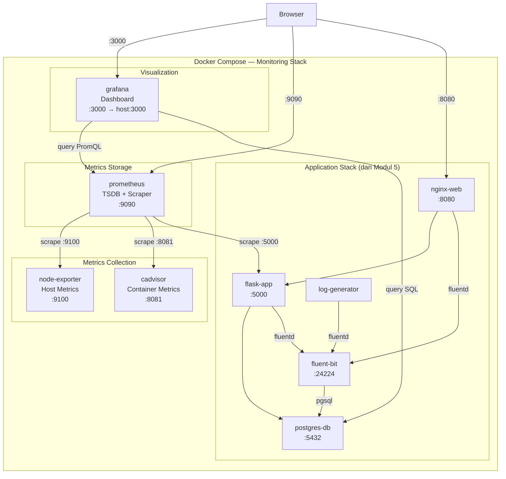

# MODUL 6: Grafana Service Docker untuk Monitoring Resource

**Topik:** Deployment Grafana, Prometheus, Node Exporter, dan cAdvisor untuk Monitoring Infrastructure & Container Resource  
**Durasi:** 120 menit  
**Prasyarat:** Modul 5 selesai (stack logging dengan Fluent Bit + PostgreSQL berjalan)

---

## 1. TUJUAN PEMBELAJARAN

Setelah praktikum ini, mahasiswa mampu:

1. Memahami arsitektur monitoring berbasis Prometheus + Grafana
2. Men-deploy Prometheus sebagai metrics collector dan time-series database di Docker
3. Men-deploy Node Exporter untuk mengumpulkan metrik host (CPU, RAM, disk, network)
4. Men-deploy cAdvisor untuk mengumpulkan metrik per-container Docker
5. Men-deploy Grafana sebagai dashboard visualization platform di Docker
6. Mengkonfigurasi Prometheus data source di Grafana
7. Membuat dan mengkustomisasi dashboard Grafana: panel, query PromQL, alert threshold
8. Mengintegrasikan log dari PostgreSQL (Modul 5) ke dashboard Grafana
9. Mengorkestrasi seluruh monitoring stack dengan Docker Compose

---

## 2. DASAR TEORI

### 2.1 Monitoring vs Logging

| Aspek | Monitoring (Metrics) | Logging |
|---|---|---|
| Data | Numerik time-series (CPU%, memory, request/s) | Teks terstruktur/tidak terstruktur (event, error) |
| Tujuan | Trend, alerting, capacity planning | Debugging, audit trail, forensik |
| Volume | Rendah–sedang (angka agregat) | Tinggi (setiap event dicatat) |
| Query | PromQL, rata-rata, percentile | Full-text search, filter |
| Retention | Minggu–bulan (downsampled) | Hari–minggu (raw) |
| Tool | Prometheus, Grafana, Datadog | ELK, Fluent Bit, Loki |

Monitoring dan logging saling melengkapi. Monitoring memberi tahu **ada masalah** (CPU spike, container restart), logging menjelaskan **mengapa** (error message, stack trace).

### 2.2 Arsitektur Prometheus

Prometheus menggunakan model **pull-based**: Prometheus secara aktif melakukan HTTP GET ke endpoint `/metrics` dari setiap target pada interval tertentu (scrape). Target meng-expose metrik dalam format text Prometheus.

```
                     ┌──────────────────────┐
                     │      Prometheus      │
                     │  (Scraper + TSDB)    │
                     │  Port 9090           │
                     └──┬────┬────┬────┬───┘
                        │    │    │    │
            scrape /metrics setiap 15 detik
                        │    │    │    │
              ┌─────────▼┐ ┌▼────▼┐ ┌─▼─────────┐
              │  Node    │ │cAdv- │ │  Flask App │
              │ Exporter │ │isor  │ │ /metrics   │
              │ :9100    │ │:8081 │ │ :5000      │
              └──────────┘ └──────┘ └────────────┘
                  Host       Docker     Application
                 metrics    metrics      metrics
```

### 2.3 Komponen Monitoring Stack

| Komponen | Fungsi | Port | Image |
|---|---|---|---|
| **Prometheus** | Scrape metrik, simpan time-series, query PromQL | 9090 | `prom/prometheus` |
| **Node Exporter** | Expose metrik host: CPU, memory, disk, network | 9100 | `prom/node-exporter` |
| **cAdvisor** | Expose metrik per-container Docker: CPU, mem, I/O | 8081 | `gcr.io/cadvisor/cadvisor` |
| **Grafana** | Visualisasi dashboard, alerting, data source management | 3000 | `grafana/grafana` |

### 2.4 PromQL (Prometheus Query Language)

PromQL digunakan untuk query metrik di Prometheus dan Grafana. Beberapa contoh:

| Query PromQL | Deskripsi |
|---|---|
| `node_cpu_seconds_total` | Total detik CPU per mode (idle, user, system) |
| `rate(node_cpu_seconds_total{mode="idle"}[5m])` | Rate idle CPU dalam 5 menit terakhir |
| `100 - (avg(rate(node_cpu_seconds_total{mode="idle"}[5m])) * 100)` | CPU usage % |
| `node_memory_MemAvailable_bytes / node_memory_MemTotal_bytes * 100` | Memory available % |
| `rate(container_cpu_usage_seconds_total[5m])` | CPU usage per container |
| `container_memory_usage_bytes` | Memory usage per container |

### 2.5 Grafana Data Source & Dashboard

Grafana tidak menyimpan data sendiri. Grafana terhubung ke **data source** (Prometheus, PostgreSQL, Elasticsearch, dll.) dan menampilkan data dalam bentuk panel-panel di dashboard. Dashboard bisa dibuat manual atau diimpor dari Grafana.com menggunakan **Dashboard ID**.

---

## 3. TOPOLOGI LAB



---

## 4. LANGKAH PRAKTIKUM

### Langkah 0: Persiapan Project

```bash
mkdir -p ~/docker-lab/monitoring/{prometheus,grafana/{provisioning/datasources,provisioning/dashboards,dashboards},app,generator,fluent-bit,init}
cd ~/docker-lab/monitoring
```

---

### Langkah 1: Konfigurasi Prometheus

#### 1.1 Buat konfigurasi scrape

```bash
cat > prometheus/prometheus.yml << 'EOF'
# ==============================================
# Prometheus Configuration
# ==============================================
global:
  scrape_interval: 15s        # Scrape setiap 15 detik
  evaluation_interval: 15s    # Evaluasi rules setiap 15 detik
  scrape_timeout: 10s

# ==============================================
# Alerting Rules
# ==============================================
rule_files:
  - "alert_rules.yml"

# ==============================================
# Scrape Targets
# ==============================================
scrape_configs:

  # --- Prometheus self-monitoring ---
  - job_name: "prometheus"
    static_configs:
      - targets: ["localhost:9090"]
        labels:
          instance: "prometheus-server"

  # --- Node Exporter (host metrics) ---
  - job_name: "node-exporter"
    static_configs:
      - targets: ["node-exporter:9100"]
        labels:
          instance: "docker-host"

  # --- cAdvisor (container metrics) ---
  - job_name: "cadvisor"
    static_configs:
      - targets: ["cadvisor:8080"]
        labels:
          instance: "docker-containers"

  # --- Flask Application ---
  - job_name: "flask-app"
    metrics_path: "/metrics"
    static_configs:
      - targets: ["flask-app:5000"]
        labels:
          instance: "flask-backend"
EOF
```

#### 1.2 Buat alert rules

```bash
cat > prometheus/alert_rules.yml << 'EOF'
groups:
  - name: host_alerts
    rules:
      # CPU usage > 80% selama 2 menit
      - alert: HighCpuUsage
        expr: 100 - (avg(rate(node_cpu_seconds_total{mode="idle"}[5m])) * 100) > 80
        for: 2m
        labels:
          severity: warning
        annotations:
          summary: "CPU usage tinggi ({{ $value | printf \"%.1f\" }}%)"
          description: "CPU usage di atas 80% selama lebih dari 2 menit."

      # Memory available < 20%
      - alert: LowMemoryAvailable
        expr: (node_memory_MemAvailable_bytes / node_memory_MemTotal_bytes * 100) < 20
        for: 2m
        labels:
          severity: warning
        annotations:
          summary: "Memory tersedia rendah ({{ $value | printf \"%.1f\" }}%)"

      # Disk usage > 85%
      - alert: HighDiskUsage
        expr: 100 - (node_filesystem_avail_bytes{mountpoint="/"} / node_filesystem_size_bytes{mountpoint="/"} * 100) > 85
        for: 5m
        labels:
          severity: critical
        annotations:
          summary: "Disk usage tinggi ({{ $value | printf \"%.1f\" }}%)"

  - name: container_alerts
    rules:
      # Container restart > 3 kali dalam 15 menit
      - alert: ContainerRestartFrequent
        expr: increase(container_restart_count[15m]) > 3
        for: 1m
        labels:
          severity: critical
        annotations:
          summary: "Container {{ $labels.name }} restart berulang"

      # Container memory > 256MB
      - alert: ContainerHighMemory
        expr: container_memory_usage_bytes{name!=""} > 268435456
        for: 5m
        labels:
          severity: warning
        annotations:
          summary: "Container {{ $labels.name }} memory > 256MB"
EOF
```

---

### Langkah 2: Konfigurasi Grafana (Provisioning)

Grafana provisioning memungkinkan konfigurasi otomatis data source dan dashboard saat Grafana pertama kali start, tanpa setup manual via UI.

#### 2.1 Provisioning data source

```bash
cat > grafana/provisioning/datasources/datasources.yml << 'EOF'
apiVersion: 1

datasources:
  # --- Prometheus (metrics) ---
  - name: Prometheus
    uid: prometheus
    type: prometheus
    access: proxy
    url: http://prometheus:9090
    isDefault: true
    editable: true
    jsonData:
      timeInterval: "15s"

  # --- PostgreSQL (logs dari Modul 5) ---
  - name: PostgreSQL-Logs
    uid: postgresql-logs
    type: grafana-postgresql-datasource
    access: proxy
    url: postgres-db:5432
    database: labdb
    user: labuser
    secureJsonData:
      password: labpass123
    jsonData:
      sslmode: disable
      maxOpenConns: 5
      postgresVersion: 1600
      timescaledb: false
    editable: true
EOF
```

#### 2.2 Provisioning dashboard

```bash
cat > grafana/provisioning/dashboards/dashboards.yml << 'EOF'
apiVersion: 1

providers:
  - name: "Lab PENS Dashboards"
    orgId: 1
    folder: "Lab PENS"
    type: file
    disableDeletion: false
    editable: true
    updateIntervalSeconds: 30
    options:
      path: /var/lib/grafana/dashboards
      foldersFromFilesStructure: false
EOF
```

#### 2.3 Buat Dashboard JSON: Docker Host Overview

```bash
cat > grafana/dashboards/docker-host-overview.json << 'JSONEOF'
{
  "annotations": { "list": [] },
  "editable": true,
  "fiscalYearStartMonth": 0,
  "graphTooltip": 1,
  "links": [],
  "panels": [
    {
      "title": "CPU Usage %",
      "type": "gauge",
      "gridPos": { "h": 6, "w": 6, "x": 0, "y": 0 },
      "datasource": { "type": "prometheus", "uid": "prometheus" },
      "fieldConfig": {
        "defaults": {
          "thresholds": {
            "mode": "absolute",
            "steps": [
              { "color": "green", "value": null },
              { "color": "yellow", "value": 60 },
              { "color": "red", "value": 85 }
            ]
          },
          "unit": "percent", "min": 0, "max": 100
        },
        "overrides": []
      },
      "targets": [{
        "expr": "100 - (avg(rate(node_cpu_seconds_total{mode=\"idle\"}[5m])) * 100)",
        "legendFormat": "CPU Usage"
      }]
    },
    {
      "title": "Memory Usage %",
      "type": "gauge",
      "gridPos": { "h": 6, "w": 6, "x": 6, "y": 0 },
      "datasource": { "type": "prometheus", "uid": "prometheus" },
      "fieldConfig": {
        "defaults": {
          "thresholds": {
            "mode": "absolute",
            "steps": [
              { "color": "green", "value": null },
              { "color": "yellow", "value": 70 },
              { "color": "red", "value": 90 }
            ]
          },
          "unit": "percent", "min": 0, "max": 100
        },
        "overrides": []
      },
      "targets": [{
        "expr": "100 - (node_memory_MemAvailable_bytes / node_memory_MemTotal_bytes * 100)",
        "legendFormat": "Memory Used"
      }]
    },
    {
      "title": "Disk Usage %",
      "type": "gauge",
      "gridPos": { "h": 6, "w": 6, "x": 12, "y": 0 },
      "datasource": { "type": "prometheus", "uid": "prometheus" },
      "fieldConfig": {
        "defaults": {
          "thresholds": {
            "mode": "absolute",
            "steps": [
              { "color": "green", "value": null },
              { "color": "yellow", "value": 70 },
              { "color": "red", "value": 85 }
            ]
          },
          "unit": "percent", "min": 0, "max": 100
        },
        "overrides": []
      },
      "targets": [{
        "expr": "100 - (node_filesystem_avail_bytes{mountpoint=\"/\"} / node_filesystem_size_bytes{mountpoint=\"/\"} * 100)",
        "legendFormat": "Disk Used"
      }]
    },
    {
      "title": "System Uptime",
      "type": "stat",
      "gridPos": { "h": 6, "w": 6, "x": 18, "y": 0 },
      "datasource": { "type": "prometheus", "uid": "prometheus" },
      "fieldConfig": { "defaults": { "unit": "s" }, "overrides": [] },
      "targets": [{
        "expr": "node_time_seconds - node_boot_time_seconds",
        "legendFormat": "Uptime"
      }]
    },
    {
      "title": "CPU Usage Over Time",
      "type": "timeseries",
      "gridPos": { "h": 8, "w": 12, "x": 0, "y": 6 },
      "datasource": { "type": "prometheus", "uid": "prometheus" },
      "fieldConfig": { "defaults": { "unit": "percent", "min": 0, "max": 100 }, "overrides": [] },
      "targets": [
        { "expr": "100 - (avg(rate(node_cpu_seconds_total{mode=\"idle\"}[5m])) * 100)", "legendFormat": "Total CPU %" },
        { "expr": "avg(rate(node_cpu_seconds_total{mode=\"user\"}[5m])) * 100", "legendFormat": "User" },
        { "expr": "avg(rate(node_cpu_seconds_total{mode=\"system\"}[5m])) * 100", "legendFormat": "System" },
        { "expr": "avg(rate(node_cpu_seconds_total{mode=\"iowait\"}[5m])) * 100", "legendFormat": "IOWait" }
      ]
    },
    {
      "title": "Memory Breakdown",
      "type": "timeseries",
      "gridPos": { "h": 8, "w": 12, "x": 12, "y": 6 },
      "datasource": { "type": "prometheus", "uid": "prometheus" },
      "fieldConfig": { "defaults": { "unit": "bytes" }, "overrides": [] },
      "options": { "tooltip": { "mode": "multi" } },
      "targets": [
        { "expr": "node_memory_MemTotal_bytes", "legendFormat": "Total" },
        { "expr": "node_memory_MemTotal_bytes - node_memory_MemAvailable_bytes", "legendFormat": "Used" },
        { "expr": "node_memory_MemAvailable_bytes", "legendFormat": "Available" },
        { "expr": "node_memory_Cached_bytes", "legendFormat": "Cached" },
        { "expr": "node_memory_Buffers_bytes", "legendFormat": "Buffers" }
      ]
    },
    {
      "title": "Network Traffic (eth0)",
      "type": "timeseries",
      "gridPos": { "h": 8, "w": 12, "x": 0, "y": 14 },
      "datasource": { "type": "prometheus", "uid": "prometheus" },
      "fieldConfig": { "defaults": { "unit": "Bps" }, "overrides": [] },
      "targets": [
        { "expr": "rate(node_network_receive_bytes_total{device=\"eth0\"}[5m])", "legendFormat": "Received" },
        { "expr": "rate(node_network_transmit_bytes_total{device=\"eth0\"}[5m])", "legendFormat": "Transmitted" }
      ]
    },
    {
      "title": "Disk I/O",
      "type": "timeseries",
      "gridPos": { "h": 8, "w": 12, "x": 12, "y": 14 },
      "datasource": { "type": "prometheus", "uid": "prometheus" },
      "fieldConfig": { "defaults": { "unit": "Bps" }, "overrides": [] },
      "targets": [
        { "expr": "rate(node_disk_read_bytes_total[5m])", "legendFormat": "Read {{ device }}" },
        { "expr": "rate(node_disk_written_bytes_total[5m])", "legendFormat": "Write {{ device }}" }
      ]
    }
  ],
  "schemaVersion": 39,
  "tags": ["pens", "docker", "host"],
  "templating": { "list": [] },
  "time": { "from": "now-1h", "to": "now" },
  "title": "Docker Host Overview",
  "uid": "pens-host-overview"
}
JSONEOF
```

#### 2.4 Buat Dashboard JSON: Container Metrics

```bash
cat > grafana/dashboards/container-metrics.json << 'JSONEOF'
{
  "annotations": { "list": [] },
  "editable": true,
  "panels": [
    {
      "title": "Running Containers",
      "type": "stat",
      "gridPos": { "h": 4, "w": 6, "x": 0, "y": 0 },
      "datasource": { "type": "prometheus", "uid": "prometheus" },
      "fieldConfig": { "defaults": { "color": { "mode": "thresholds" }, "thresholds": { "steps": [{ "color": "green", "value": null }] } }, "overrides": [] },
      "targets": [{ "expr": "count(container_last_seen{name!=\"\"})", "legendFormat": "Containers" }]
    },
    {
      "title": "Total Container CPU Usage",
      "type": "stat",
      "gridPos": { "h": 4, "w": 6, "x": 6, "y": 0 },
      "datasource": { "type": "prometheus", "uid": "prometheus" },
      "fieldConfig": { "defaults": { "unit": "percent", "thresholds": { "steps": [{ "color": "green", "value": null }, { "color": "red", "value": 80 }] } }, "overrides": [] },
      "targets": [{ "expr": "sum(rate(container_cpu_usage_seconds_total{name!=\"\"}[5m])) * 100", "legendFormat": "Total CPU" }]
    },
    {
      "title": "Total Container Memory",
      "type": "stat",
      "gridPos": { "h": 4, "w": 6, "x": 12, "y": 0 },
      "datasource": { "type": "prometheus", "uid": "prometheus" },
      "fieldConfig": { "defaults": { "unit": "bytes", "thresholds": { "steps": [{ "color": "green", "value": null }] } }, "overrides": [] },
      "targets": [{ "expr": "sum(container_memory_usage_bytes{name!=\"\"})", "legendFormat": "Total Memory" }]
    },
    {
      "title": "Prometheus Alerts Active",
      "type": "stat",
      "gridPos": { "h": 4, "w": 6, "x": 18, "y": 0 },
      "datasource": { "type": "prometheus", "uid": "prometheus" },
      "fieldConfig": { "defaults": { "thresholds": { "steps": [{ "color": "green", "value": null }, { "color": "red", "value": 1 }] } }, "overrides": [] },
      "targets": [{ "expr": "count(ALERTS{alertstate=\"firing\"}) OR vector(0)", "legendFormat": "Firing" }]
    },
    {
      "title": "CPU Usage per Container",
      "type": "timeseries",
      "gridPos": { "h": 8, "w": 12, "x": 0, "y": 4 },
      "datasource": { "type": "prometheus", "uid": "prometheus" },
      "fieldConfig": { "defaults": { "unit": "percent" }, "overrides": [] },
      "targets": [{ "expr": "rate(container_cpu_usage_seconds_total{name!=\"\"}[5m]) * 100", "legendFormat": "{{ name }}" }]
    },
    {
      "title": "Memory Usage per Container",
      "type": "timeseries",
      "gridPos": { "h": 8, "w": 12, "x": 12, "y": 4 },
      "datasource": { "type": "prometheus", "uid": "prometheus" },
      "fieldConfig": { "defaults": { "unit": "bytes" }, "overrides": [] },
      "targets": [{ "expr": "container_memory_usage_bytes{name!=\"\"}", "legendFormat": "{{ name }}" }]
    },
    {
      "title": "Container Network RX",
      "type": "timeseries",
      "gridPos": { "h": 8, "w": 12, "x": 0, "y": 12 },
      "datasource": { "type": "prometheus", "uid": "prometheus" },
      "fieldConfig": { "defaults": { "unit": "Bps" }, "overrides": [] },
      "targets": [{ "expr": "rate(container_network_receive_bytes_total{name!=\"\"}[5m])", "legendFormat": "{{ name }}" }]
    },
    {
      "title": "Container Network TX",
      "type": "timeseries",
      "gridPos": { "h": 8, "w": 12, "x": 12, "y": 12 },
      "datasource": { "type": "prometheus", "uid": "prometheus" },
      "fieldConfig": { "defaults": { "unit": "Bps" }, "overrides": [] },
      "targets": [{ "expr": "rate(container_network_transmit_bytes_total{name!=\"\"}[5m])", "legendFormat": "{{ name }}" }]
    }
  ],
  "schemaVersion": 39,
  "tags": ["pens", "docker", "containers"],
  "time": { "from": "now-1h", "to": "now" },
  "title": "Container Metrics",
  "uid": "pens-container-metrics"
}
JSONEOF
```

#### 2.5 Buat Dashboard JSON: Log Analytics (PostgreSQL)

```bash
cat > grafana/dashboards/log-analytics.json << 'JSONEOF'
{
  "annotations": { "list": [] },
  "editable": true,
  "panels": [
    {
      "title": "Total Logs (All Time)",
      "type": "stat",
      "gridPos": { "h": 4, "w": 6, "x": 0, "y": 0 },
      "datasource": { "type": "grafana-postgresql-datasource", "uid": "postgresql-logs" },
      "fieldConfig": { "defaults": { "thresholds": { "steps": [{ "color": "blue", "value": null }] } }, "overrides": [] },
      "targets": [{
        "rawSql": "SELECT COUNT(*) AS total FROM logs.fluentbit;",
        "format": "table"
      }]
    },
    {
      "title": "Errors Last Hour",
      "type": "stat",
      "gridPos": { "h": 4, "w": 6, "x": 6, "y": 0 },
      "datasource": { "type": "grafana-postgresql-datasource", "uid": "postgresql-logs" },
      "fieldConfig": { "defaults": { "thresholds": { "steps": [{ "color": "green", "value": null }, { "color": "red", "value": 10 }] } }, "overrides": [] },
      "targets": [{
        "rawSql": "SELECT COUNT(*) AS errors FROM logs.structured_logs WHERE log_level IN ('ERROR','CRITICAL') AND received_at > NOW() - INTERVAL '1 hour';",
        "format": "table"
      }]
    },
    {
      "title": "Log Volume per Minute",
      "type": "timeseries",
      "gridPos": { "h": 8, "w": 24, "x": 0, "y": 4 },
      "datasource": { "type": "grafana-postgresql-datasource", "uid": "postgresql-logs" },
      "targets": [{
        "rawSql": "SELECT date_trunc('minute', time) AS time, COUNT(*) AS count FROM logs.fluentbit WHERE $__timeFilter(time) GROUP BY 1 ORDER BY 1;",
        "format": "time_series"
      }]
    },
    {
      "title": "Log Level Distribution",
      "type": "piechart",
      "gridPos": { "h": 8, "w": 8, "x": 0, "y": 12 },
      "datasource": { "type": "grafana-postgresql-datasource", "uid": "postgresql-logs" },
      "targets": [{
        "rawSql": "SELECT log_level AS metric, COUNT(*) AS value FROM logs.structured_logs WHERE received_at > NOW() - INTERVAL '1 hour' GROUP BY log_level ORDER BY value DESC;",
        "format": "table"
      }]
    },
    {
      "title": "Logs per Container",
      "type": "barchart",
      "gridPos": { "h": 8, "w": 8, "x": 8, "y": 12 },
      "datasource": { "type": "grafana-postgresql-datasource", "uid": "postgresql-logs" },
      "targets": [{
        "rawSql": "SELECT tag AS metric, COUNT(*) AS value FROM logs.fluentbit WHERE time > NOW() - INTERVAL '1 hour' GROUP BY tag ORDER BY value DESC;",
        "format": "table"
      }]
    },
    {
      "title": "Recent Errors & Critical",
      "type": "table",
      "gridPos": { "h": 8, "w": 8, "x": 16, "y": 12 },
      "datasource": { "type": "grafana-postgresql-datasource", "uid": "postgresql-logs" },
      "targets": [{
        "rawSql": "SELECT to_char(received_at, 'HH24:MI:SS') AS time, container_name, log_level, LEFT(message, 120) AS message FROM logs.structured_logs WHERE log_level IN ('ERROR','CRITICAL') ORDER BY received_at DESC LIMIT 20;",
        "format": "table"
      }]
    }
  ],
  "schemaVersion": 39,
  "tags": ["pens", "logs", "postgresql"],
  "time": { "from": "now-1h", "to": "now" },
  "title": "Log Analytics (PostgreSQL)",
  "uid": "pens-log-analytics"
}
JSONEOF
```

---

### Langkah 3: Buat Flask App dengan Prometheus Metrics

```bash
cat > app/requirements.txt << 'EOF'
flask==3.1.*
psycopg2-binary==2.9.*
prometheus-client==0.21.*
EOF

cat > app/app.py << 'PYEOF'
"""Flask app dengan Prometheus metrics endpoint dan structured logging."""
import os, json, socket, datetime, logging, sys, time
from flask import Flask, jsonify, request, Response
import psycopg2
from prometheus_client import Counter, Histogram, Gauge, generate_latest, CONTENT_TYPE_LATEST

app = Flask(__name__)

# --- Prometheus Metrics ---
REQUEST_COUNT = Counter(
    "flask_http_requests_total",
    "Total HTTP requests",
    ["method", "endpoint", "status"]
)
REQUEST_LATENCY = Histogram(
    "flask_http_request_duration_seconds",
    "HTTP request latency",
    ["method", "endpoint"],
    buckets=[0.01, 0.05, 0.1, 0.25, 0.5, 1.0, 2.5, 5.0]
)
DB_CONNECTIONS = Gauge(
    "flask_db_connections_active",
    "Active database connections"
)
LOG_COUNT = Gauge(
    "flask_log_total_count",
    "Total logs in PostgreSQL"
)

# --- Structured JSON Logging ---
class JSONFormatter(logging.Formatter):
    def format(self, record):
        return json.dumps({
            "timestamp": datetime.datetime.now().isoformat(),
            "level": record.levelname,
            "hostname": socket.gethostname(),
            "service": "flask-app",
            "message": record.getMessage()
        })

handler = logging.StreamHandler(sys.stdout)
handler.setFormatter(JSONFormatter())
app.logger.handlers = [handler]
app.logger.setLevel(logging.INFO)

DB = dict(host=os.environ.get("DB_HOST", "postgres-db"),
          dbname=os.environ.get("DB_NAME", "labdb"),
          user=os.environ.get("DB_USER", "labuser"),
          password=os.environ.get("DB_PASS", "labpass123"))

@app.before_request
def before():
    request._start_time = time.time()

@app.after_request
def after(response):
    latency = time.time() - getattr(request, "_start_time", time.time())
    endpoint = request.endpoint or "unknown"
    REQUEST_COUNT.labels(request.method, endpoint, response.status_code).inc()
    REQUEST_LATENCY.labels(request.method, endpoint).observe(latency)
    return response

@app.route("/")
def index():
    app.logger.info(f"Index accessed from {request.remote_addr}")
    return jsonify({"service": "flask-app", "status": "running",
                    "hostname": socket.gethostname()})

@app.route("/metrics")
def metrics():
    """Prometheus metrics endpoint."""
    try:
        conn = psycopg2.connect(**DB); cur = conn.cursor()
        cur.execute("SELECT COUNT(*) FROM logs.fluentbit")
        LOG_COUNT.set(cur.fetchone()[0])
        cur.execute("SELECT count(*) FROM pg_stat_activity WHERE datname = %s", (DB["dbname"],))
        DB_CONNECTIONS.set(cur.fetchone()[0])
        cur.close(); conn.close()
    except Exception:
        pass
    return Response(generate_latest(), mimetype=CONTENT_TYPE_LATEST)

@app.route("/api/health")
def health():
    try:
        conn = psycopg2.connect(**DB); cur = conn.cursor()
        cur.execute("SELECT version();")
        ver = cur.fetchone()[0]; cur.close(); conn.close()
        return jsonify({"status": "ok", "database": ver, "db_status": "connected"})
    except Exception as e:
        return jsonify({"status": "error", "db_status": str(e)}), 500

@app.route("/api/logs/stats")
def log_stats():
    try:
        conn = psycopg2.connect(**DB); cur = conn.cursor()
        cur.execute("""SELECT log_level, COUNT(*)
                       FROM logs.structured_logs
                       WHERE received_at > NOW() - INTERVAL '1 hour'
                       GROUP BY log_level ORDER BY count DESC""")
        stats = [{"level": r[0], "count": r[1]} for r in cur.fetchall()]
        cur.execute("SELECT COUNT(*) FROM logs.fluentbit")
        total = cur.fetchone()[0]; cur.close(); conn.close()
        return jsonify({"total_logs": total, "last_hour": stats})
    except Exception as e:
        return jsonify({"error": str(e)}), 500

if __name__ == "__main__":
    app.run(host="0.0.0.0", port=5000)
PYEOF

cat > app/Dockerfile << 'EOF'
FROM python:3.11-slim
WORKDIR /app
COPY requirements.txt .
RUN pip install --no-cache-dir -r requirements.txt
COPY app.py .
EXPOSE 5000
CMD ["python", "-u", "app.py"]
EOF
```

---

### Langkah 4: Siapkan Fluent Bit, Log Generator, dan Init Script

Copy konfigurasi dari Modul 5 (atau buat ulang):

```bash
# --- Fluent Bit ---
cat > fluent-bit/fluent-bit.conf << 'EOF'
[SERVICE]
    Flush        5
    Daemon       Off
    Log_Level    info
    Parsers_File parsers.conf

[INPUT]
    Name         forward
    Listen       0.0.0.0
    Port         24224

[OUTPUT]
    Name         pgsql
    Match        *
    Host         postgres-db
    Port         5432
    User         labuser
    Password     labpass123
    Database     labdb
    Table        fluentbit
    Connection_Options -c search_path=logs
    Timestamp_Key date
    Async        false
    min_pool_size 1
    max_pool_size 4

[OUTPUT]
    Name         stdout
    Match        *
    Format       json_lines
EOF

cat > fluent-bit/parsers.conf << 'EOF'
[PARSER]
    Name         docker
    Format       json
    Time_Key     time
    Time_Format  %Y-%m-%dT%H:%M:%S.%L
    Time_Keep    On
EOF

# --- Log Generator ---
cat > generator/generator.py << 'PYEOF'
import json, time, random, socket, datetime, os

HOSTNAME = socket.gethostname()
INTERVAL = float(os.environ.get("LOG_INTERVAL", "3"))

EVENTS = [
    {"level": "INFO",     "weight": 50, "msgs": [
        "User login successful", "Page loaded in {ms}ms",
        "API GET /api/users completed", "Health check passed"]},
    {"level": "DEBUG",    "weight": 20, "msgs": [
        "DB query {ms}ms", "Cache hit key:product_{pid}"]},
    {"level": "WARN",     "weight": 15, "msgs": [
        "Slow query {ms}ms", "Memory at {mem}%", "Rate limit near"]},
    {"level": "ERROR",    "weight": 10, "msgs": [
        "DB connection timeout", "HTTP 500 on /api/checkout",
        "Payment gateway error {code}"]},
    {"level": "CRITICAL", "weight": 5,  "msgs": [
        "Connection pool exhausted", "OOM kill triggered"]}
]

def pick():
    total = sum(e["weight"] for e in EVENTS)
    r = random.uniform(0, total); c = 0
    for e in EVENTS:
        c += e["weight"]
        if r <= c: return e
    return EVENTS[0]

while True:
    e = pick(); msg = random.choice(e["msgs"]).format(
        ms=random.randint(5,3000), pid=random.randint(1,500),
        mem=random.randint(60,98), code=random.choice([400,500,502,503]))
    print(json.dumps({"timestamp": datetime.datetime.now().isoformat(),
        "level": e["level"], "hostname": HOSTNAME, "service": "log-generator",
        "message": msg}), flush=True)
    time.sleep(INTERVAL + random.uniform(-0.5, 0.5))
PYEOF

cat > generator/Dockerfile << 'EOF'
FROM python:3.11-alpine
WORKDIR /app
COPY generator.py .
CMD ["python", "-u", "generator.py"]
EOF

# --- Init SQL (dari Modul 5 — schema sesuai Fluent Bit pgsql plugin) ---
cat > init/01-logging-schema.sql << 'EOF'
-- ==============================================
-- PENTING: Fluent Bit pgsql plugin INSERT ke kolom:
--   tag (text), time (timestamptz), data (jsonb)
-- Jangan ubah nama kolom ini — harus persis sesuai plugin.
-- ==============================================

CREATE SCHEMA IF NOT EXISTS logs;

-- Tabel utama: format sesuai Fluent Bit pgsql plugin
-- HANYA 3 kolom: tag, time, data — jangan tambah kolom lain
CREATE TABLE logs.fluentbit (
    tag      TEXT,
    time     TIMESTAMP WITHOUT TIME ZONE,
    data     JSONB
);

-- Index untuk performa query
CREATE INDEX idx_fb_time ON logs.fluentbit(time);
CREATE INDEX idx_fb_tag  ON logs.fluentbit(tag);
CREATE INDEX idx_fb_data ON logs.fluentbit USING GIN(data);

-- ==============================================
-- FUNGSI: Safe JSON parser — mengembalikan NULL
-- jika input bukan JSON valid (tanpa error)
-- ==============================================
CREATE OR REPLACE FUNCTION logs.try_parse_jsonb(input_text TEXT)
RETURNS JSONB AS $$
BEGIN
    RETURN input_text::JSONB;
EXCEPTION
    WHEN OTHERS THEN
        RETURN NULL;
END;
$$ LANGUAGE plpgsql IMMUTABLE;

-- ==============================================
-- VIEWS: Parsing JSONB ke format readable
-- ==============================================

-- View: semua log dengan field diekstrak dari JSONB
CREATE OR REPLACE VIEW logs.parsed_logs AS
SELECT
    row_number() OVER (ORDER BY time DESC) AS id,
    tag,
    time AS received_at,
    -- Container info (diisi oleh Docker fluentd driver)
    REPLACE(data->>'container_name', '/', '') AS container_name,
    LEFT(data->>'container_id', 12)           AS container_id,
    data->>'source'                           AS source,
    -- Isi log (bisa plain text atau JSON)
    data->>'log'                              AS raw_log,
    -- Jika log berbentuk JSON, ekstrak level dan message
    CASE
        WHEN logs.try_parse_jsonb(data->>'log') IS NOT NULL
        THEN logs.try_parse_jsonb(data->>'log')->>'level'
        ELSE NULL
    END AS log_level,
    CASE
        WHEN logs.try_parse_jsonb(data->>'log') IS NOT NULL
        THEN logs.try_parse_jsonb(data->>'log')->>'message'
        ELSE data->>'log'
    END AS message
FROM logs.fluentbit
ORDER BY time DESC;

-- View: log terbaru (100 entry)
CREATE OR REPLACE VIEW logs.recent_logs AS
SELECT
    row_number() OVER (ORDER BY time DESC) AS id,
    to_char(time, 'YYYY-MM-DD HH24:MI:SS') AS time,
    tag,
    REPLACE(data->>'container_name', '/', '') AS container,
    data->>'source' AS source,
    LEFT(data->>'log', 200) AS log_preview
FROM logs.fluentbit
ORDER BY time DESC
LIMIT 100;

-- View: log yang berisi JSON — parsed level dan message
-- (untuk log-generator dan flask yang output structured JSON)
CREATE OR REPLACE VIEW logs.structured_logs AS
SELECT
    row_number() OVER (ORDER BY time DESC) AS id,
    time AS received_at,
    tag,
    REPLACE(data->>'container_name', '/', '') AS container_name,
    logs.try_parse_jsonb(data->>'log')->>'level'    AS log_level,
    logs.try_parse_jsonb(data->>'log')->>'message'  AS message,
    logs.try_parse_jsonb(data->>'log')->>'hostname' AS hostname,
    logs.try_parse_jsonb(data->>'log')->>'service'  AS service
FROM logs.fluentbit
WHERE data->>'log' IS NOT NULL
  AND LEFT(TRIM(data->>'log'), 1) = '{'
ORDER BY time DESC;

-- View: error summary per container
CREATE OR REPLACE VIEW logs.error_summary AS
SELECT
    REPLACE(data->>'container_name', '/', '') AS container_name,
    logs.try_parse_jsonb(data->>'log')->>'level' AS log_level,
    COUNT(*)                                      AS count,
    MAX(time)                                     AS last_seen
FROM logs.fluentbit
WHERE data->>'log' IS NOT NULL
  AND LEFT(TRIM(data->>'log'), 1) = '{'
  AND logs.try_parse_jsonb(data->>'log')->>'level' IN ('ERROR', 'WARN', 'CRITICAL')
GROUP BY 1, 2
ORDER BY count DESC;

-- Fungsi: cleanup log > 30 hari
CREATE OR REPLACE FUNCTION logs.cleanup_old_logs()
RETURNS INTEGER AS $$
DECLARE
    deleted_count INTEGER;
BEGIN
    DELETE FROM logs.fluentbit
    WHERE time < NOW() - INTERVAL '30 days';
    GET DIAGNOSTICS deleted_count = ROW_COUNT;
    RETURN deleted_count;
END;
$$ LANGUAGE plpgsql;
EOF
```

---

### Langkah 5: Docker Compose — Full Monitoring Stack

```bash
cat > docker-compose.yml << 'EOF'
services:

  # ============================================
  # MONITORING LAYER
  # ============================================

  # --- Prometheus (Metrics TSDB) ---
  prometheus:
    image: prom/prometheus:latest
    container_name: prometheus
    ports:
      - "9090:9090"
    volumes:
      - ./prometheus/prometheus.yml:/etc/prometheus/prometheus.yml:ro
      - ./prometheus/alert_rules.yml:/etc/prometheus/alert_rules.yml:ro
      - prom-data:/prometheus
    command:
      - "--config.file=/etc/prometheus/prometheus.yml"
      - "--storage.tsdb.path=/prometheus"
      - "--storage.tsdb.retention.time=7d"
      - "--web.enable-lifecycle"
    networks:
      - monitoring-net
    restart: unless-stopped

  # --- Node Exporter (Host Metrics) ---
  node-exporter:
    image: prom/node-exporter:latest
    container_name: node-exporter
    ports:
      - "9100:9100"
    volumes:
      - /proc:/host/proc:ro
      - /sys:/host/sys:ro
      - /:/rootfs:ro
    command:
      - "--path.procfs=/host/proc"
      - "--path.sysfs=/host/sys"
      - "--path.rootfs=/rootfs"
      - "--collector.filesystem.mount-points-exclude=^/(sys|proc|dev|host|etc)($$|/)"
    networks:
      - monitoring-net
    restart: unless-stopped

  # --- cAdvisor (Container Metrics) ---
  cadvisor:
    image: gcr.io/cadvisor/cadvisor:latest
    container_name: cadvisor
    ports:
      - "8081:8080"
    volumes:
      - /:/rootfs:ro
      - /var/run:/var/run:ro
      - /sys:/sys:ro
      - /var/lib/docker/:/var/lib/docker:ro
      - /dev/disk/:/dev/disk:ro
    privileged: true
    devices:
      - /dev/kmsg
    networks:
      - monitoring-net
    restart: unless-stopped

  # --- Grafana (Visualization) ---
  grafana:
    image: grafana/grafana:latest
    container_name: grafana
    ports:
      - "3000:3000"
    environment:
      GF_SECURITY_ADMIN_USER: admin
      GF_SECURITY_ADMIN_PASSWORD: admin123
      GF_USERS_ALLOW_SIGN_UP: "false"
      GF_DASHBOARDS_DEFAULT_HOME_DASHBOARD_PATH: /var/lib/grafana/dashboards/docker-host-overview.json
    volumes:
      - grafana-data:/var/lib/grafana
      - ./grafana/provisioning:/etc/grafana/provisioning:ro
      - ./grafana/dashboards:/var/lib/grafana/dashboards:ro
    networks:
      - monitoring-net
    depends_on:
      - prometheus
      - postgres-db
    restart: unless-stopped

  # ============================================
  # LOGGING LAYER (dari Modul 5)
  # ============================================

  fluent-bit:
    image: fluent/fluent-bit:latest
    container_name: fluent-bit
    ports:
      - "24224:24224"
      - "24224:24224/udp"
    volumes:
      - ./fluent-bit/fluent-bit.conf:/fluent-bit/etc/fluent-bit.conf:ro
      - ./fluent-bit/parsers.conf:/fluent-bit/etc/parsers.conf:ro
    networks:
      - monitoring-net
    depends_on:
      postgres-db:
        condition: service_healthy
    restart: unless-stopped

  # ============================================
  # DATA LAYER
  # ============================================

  postgres-db:
    image: postgres:16-alpine
    container_name: postgres-db
    environment:
      POSTGRES_DB: labdb
      POSTGRES_USER: labuser
      POSTGRES_PASSWORD: labpass123
      TZ: Asia/Jakarta
    ports:
      - "5432:5432"
    volumes:
      - pg-data:/var/lib/postgresql/data
      - ./init:/docker-entrypoint-initdb.d:ro
    networks:
      - monitoring-net
    healthcheck:
      test: ["CMD-SHELL", "pg_isready -U labuser -d labdb"]
      interval: 10s
      timeout: 5s
      retries: 5
    restart: unless-stopped

  # ============================================
  # APPLICATION LAYER
  # ============================================

  nginx-web:
    image: nginx:alpine
    container_name: nginx-web
    ports:
      - "8080:80"
    networks:
      - monitoring-net
    logging:
      driver: fluentd
      options:
        fluentd-address: "127.0.0.1:24224"
        fluentd-async: "true"
        tag: "docker.nginx"
    depends_on:
      - fluent-bit
    restart: unless-stopped

  flask-app:
    build: ./app
    container_name: flask-app
    environment:
      - DB_HOST=postgres-db
      - DB_NAME=labdb
      - DB_USER=labuser
      - DB_PASS=labpass123
    ports:
      - "5000:5000"
    networks:
      - monitoring-net
    logging:
      driver: fluentd
      options:
        fluentd-address: "127.0.0.1:24224"
        fluentd-async: "true"
        tag: "docker.flask"
    depends_on:
      - fluent-bit
      - postgres-db
    restart: unless-stopped

  log-generator:
    build: ./generator
    container_name: log-generator
    environment:
      - LOG_INTERVAL=3
    networks:
      - monitoring-net
    logging:
      driver: fluentd
      options:
        fluentd-address: "127.0.0.1:24224"
        fluentd-async: "true"
        tag: "docker.generator"
    depends_on:
      - fluent-bit
    restart: unless-stopped

volumes:
  prom-data:
  grafana-data:
  pg-data:

networks:
  monitoring-net:
EOF
```

---

### Langkah 6: Deploy Full Stack

```bash
# Build dan jalankan seluruh stack (9 container)
docker compose up --build -d

# Cek semua service
docker compose ps

# Tunggu 30 detik agar metrics terkumpul
sleep 30
```

#### 6.1 Reset Volume Grafana (jika provisioning berubah)

> **Catatan:** Jika Anda mengubah file provisioning (`datasources.yml`, dashboard JSON, atau `dashboards.yml`), Grafana tidak otomatis membaca ulang karena data provisioning sudah tersimpan di volume `grafana-data`. Untuk memaksa reload:

```bash
# Hentikan dan hapus volume Grafana (data dashboard custom akan hilang)
docker compose down -v grafana

# Jalankan ulang Grafana — provisioning akan di-load dari awal
docker compose up -d grafana
```

> Perintah `docker compose down -v grafana` menghapus volume `grafana-data` yang berisi konfigurasi tersimpan. Setelah restart, Grafana akan membaca ulang semua file provisioning dari `/etc/grafana/provisioning/`.

---

### Langkah 7: Verifikasi Setiap Komponen

#### 7.1 Verifikasi Prometheus

```bash
# Akses Prometheus UI
echo "Buka browser: http://localhost:9090"

# Cek targets — harus semua UP
curl -s http://localhost:9090/api/v1/targets | python3 -m json.tool | head -40

# Test query PromQL via API
# CPU usage
curl -s "http://localhost:9090/api/v1/query?query=100-(avg(rate(node_cpu_seconds_total{mode=\"idle\"}[5m]))*100)" \
    | python3 -m json.tool

# Memory available
curl -s "http://localhost:9090/api/v1/query?query=node_memory_MemAvailable_bytes" \
    | python3 -m json.tool

# Container count
curl -s "http://localhost:9090/api/v1/query?query=count(container_last_seen{name!=\"\"})" \
    | python3 -m json.tool
```

Buka `http://localhost:9090` → **Status → Targets** → pastikan semua target berstatus **UP**.

#### 7.2 Verifikasi Node Exporter

```bash
# Cek metrik host langsung
curl -s http://localhost:9100/metrics | head -30

# Cek metrik spesifik
curl -s http://localhost:9100/metrics | grep "node_cpu_seconds_total" | head -5
curl -s http://localhost:9100/metrics | grep "node_memory_MemTotal_bytes"
curl -s http://localhost:9100/metrics | grep "node_filesystem_size_bytes" | head -3
```

#### 7.3 Verifikasi cAdvisor

```bash
# Akses cAdvisor UI
echo "Buka browser: http://localhost:8081"

# Cek metrik container
curl -s http://localhost:8081/metrics | grep "container_memory_usage_bytes" | head -5
curl -s http://localhost:8081/metrics | grep "container_cpu_usage_seconds_total" | head -5
```

#### 7.4 Verifikasi Flask Prometheus Metrics

```bash
# Generate traffic
for i in $(seq 1 30); do curl -s http://localhost:5000/ > /dev/null; done
curl -s http://localhost:5000/api/health > /dev/null
curl -s http://localhost:5000/api/logs/stats > /dev/null

# Cek metrics endpoint
curl -s http://localhost:5000/metrics | grep "flask_http_requests_total"
curl -s http://localhost:5000/metrics | grep "flask_http_request_duration_seconds"
curl -s http://localhost:5000/metrics | grep "flask_log_total_count"
```

---

### Langkah 8: Eksplorasi Grafana Dashboard

#### 8.1 Login ke Grafana

1. Buka browser: `http://localhost:3000`
2. Login: `admin` / `admin123`
3. Skip change password (atau ganti sesuai keinginan)

#### 8.2 Verifikasi Data Sources

1. Buka **Connections → Data sources** (menu kiri)
2. Pastikan ada 2 data source: **Prometheus** dan **PostgreSQL-Logs**
3. Klik masing-masing → **Test** → harus "Data source is working"

#### 8.3 Validasi API Datasource & Query ke PostgreSQL

Validasi via API Grafana untuk memastikan datasource terdaftar dan query PostgreSQL berjalan:

```bash
# Daftar datasource yang terdaftar di Grafana
echo "=== Datasource terdaftar ==="
curl -s -u admin:admin123 http://localhost:3000/api/datasources \
    | python3 -m json.tool

# Cek detail datasource PostgreSQL (perhatikan uid dan type)
echo "=== Detail PostgreSQL-Logs ==="
curl -s -u admin:admin123 http://localhost:3000/api/datasources/uid/postgresql-logs \
    | python3 -m json.tool

# Test query ke PostgreSQL via Grafana API
echo "=== Test query: SELECT COUNT(*) FROM logs.fluentbit ==="
curl -s -X POST -u admin:admin123 \
    -H "Content-Type: application/json" \
    -d '{
        "queries": [{
            "refId": "A",
            "datasourceId": 2,
            "rawSql": "SELECT COUNT(*) AS total FROM logs.fluentbit;",
            "format": "table"
        }]
    }' \
    http://localhost:3000/api/ds/query | python3 -m json.tool
```

> **Catatan:** `datasourceId` bisa berbeda tergantung urutan registrasi. Gunakan API `/api/datasources` untuk mengetahui ID yang tepat, atau gunakan endpoint `/api/ds/query` dengan UID: `http://localhost:3000/api/ds/query?ds_uid=postgresql-logs`.

#### 8.4 Eksplorasi Dashboard yang Sudah di-Provision

1. Buka **Dashboards** (menu kiri)
2. Buka folder **Lab PENS** → terdapat 3 dashboard:
   - **Docker Host Overview** — gauge CPU/Memory/Disk, grafik time-series
   - **Container Metrics** — CPU/Memory/Network per container
   - **Log Analytics (PostgreSQL)** — log volume, distribusi level, recent errors

#### 8.5 Buat Panel Custom Baru

1. Buka dashboard **Container Metrics** → klik **Edit** (ikon pensil kanan atas)
2. Klik **Add → Visualization**
3. Pilih Data source: **Prometheus**
4. Di panel **Query**, masukkan PromQL:
   ```
   flask_http_requests_total
   ```
5. Set Visualization type: **Bar chart**
6. Beri judul: **Flask HTTP Requests by Endpoint**
7. Klik **Apply**

#### 8.6 Buat Alert Rule di Grafana

1. Buka **Alerting → Alert rules** (menu kiri)
2. Klik **New alert rule**
3. **Rule name:** `High CPU Alert`
4. **Query A** (Prometheus):
   ```
   100 - (avg(rate(node_cpu_seconds_total{mode="idle"}[5m])) * 100)
   ```
5. **Condition:** IS ABOVE `80`
6. **Evaluation:** Every `1m`, For `2m`
7. **Labels:** severity = warning
8. Klik **Save rule and exit**

---

### Langkah 9: Stress Test dan Observasi

#### 9.1 Generate load

```bash
# CPU stress (install stress tool di host)
sudo apt install -y stress

# Stress test CPU selama 60 detik (2 core)
stress --cpu 2 --timeout 60 &

# Bersamaan, generate HTTP traffic ke Flask
for i in $(seq 1 200); do curl -s http://localhost:5000/ > /dev/null; done &

# Generate traffic ke Nginx
for i in $(seq 1 200); do curl -s http://localhost:8080 > /dev/null; done &
```

#### 9.2 Observasi di Grafana

1. Buka dashboard **Docker Host Overview** → amati lonjakan CPU gauge dan grafik
2. Buka dashboard **Container Metrics** → amati container mana yang pakai resource terbanyak
3. Buka dashboard **Log Analytics** → amati lonjakan log volume
4. Buka **Alerting → Alert rules** → cek apakah alert CPU terpicu

#### 9.3 Screenshot semua dashboard saat load tinggi

Ambil screenshot dashboard saat `stress` masih berjalan — ini menunjukkan kemampuan monitoring mendeteksi anomali secara real-time.

---

## 5. PERTANYAAN

### Pre-Lab

1. Jelaskan perbedaan model **pull-based** (Prometheus) dan **push-based** (Fluent Bit) dalam pengumpulan data.
2. Apa itu PromQL? Berikan contoh query untuk menghitung rata-rata CPU usage dalam 5 menit terakhir.
3. Mengapa cAdvisor membutuhkan akses ke `/var/run/docker.sock` dan `/sys`?
4. Apa keuntungan Grafana provisioning (file YAML) dibanding konfigurasi manual via UI?
5. Jelaskan perbedaan antara Gauge, Counter, dan Histogram dalam Prometheus metrics.

### Post-Lab

1. Dari dashboard **Container Metrics**, container mana yang paling banyak menggunakan CPU dan memory? Mengapa?
2. Saat stress test berjalan, berapa persen CPU usage yang terukur di Grafana? Bandingkan dengan output `top` atau `htop` di host.
3. Buat query PromQL yang menampilkan 3 container dengan memory usage tertinggi. Tunjukkan query dan hasilnya.
4. Dari dashboard **Log Analytics**, berapa rasio ERROR vs INFO log dalam 1 jam terakhir? Apakah ini normal untuk aplikasi production?
5. Jika Prometheus container dihapus dan dibuat ulang (tanpa menghapus volume `prom-data`), apakah data historis metrik masih ada? Buktikan.

---

## 6. CHECKLIST

- [ ] `docker compose ps` — 9 service running (prometheus, node-exporter, cadvisor, grafana, fluent-bit, postgres-db, nginx-web, flask-app, log-generator)
- [ ] Prometheus targets — semua target berstatus **UP** di `http://localhost:9090/targets`
- [ ] Node Exporter — `curl localhost:9100/metrics` menampilkan metrik host
- [ ] cAdvisor — `curl localhost:8081/metrics` menampilkan metrik container
- [ ] Flask `/metrics` — menampilkan `flask_http_requests_total` dan custom metrics
- [ ] Grafana login berhasil — `http://localhost:3000` dengan `admin/admin123`
- [ ] `logs.fluentbit` — query `SELECT COUNT(*) FROM logs.fluentbit` menampilkan data > 0
- [ ] `logs.structured_logs` — query `SELECT * FROM logs.structured_logs LIMIT 5` menampilkan log terstruktur
- [ ] Data sources OK — Prometheus dan PostgreSQL-Logs keduanya **"Data source is working"**
- [ ] Dashboard **Docker Host Overview** — gauge CPU/Memory/Disk menampilkan data
- [ ] Dashboard **Container Metrics** — grafik CPU/Memory per container menampilkan data
- [ ] Dashboard **Log Analytics** — log volume dan distribusi level terisi dari PostgreSQL
- [ ] Custom panel berhasil dibuat — panel baru tampil di dashboard
- [ ] Alert rule dibuat — terlihat di Alerting → Alert rules
- [ ] Stress test — lonjakan CPU terlihat di Grafana secara real-time

---

## 7. TABEL TROUBLESHOOTING

| **Gejala** | **Kemungkinan Cause** | **Solusi** |
|---|---|---|
| Prometheus target **DOWN** | Container target belum running atau port salah | `docker compose ps`, pastikan container UP, cek port di `prometheus.yml` |
| Grafana "No data" di panel | Data source belum connect atau query salah | Cek **Connections → Data sources → Test**, cek query PromQL |
| Grafana dashboard kosong setelah deploy | Provisioning path salah | Cek volume mount `./grafana/dashboards` dan `provisioning/` |
| cAdvisor gagal start | Permission denied ke `/dev/kmsg` atau `/sys` | Pastikan `privileged: true` dan `devices: [/dev/kmsg]` di compose |
| Node Exporter metrik filesystem kosong | Mount point exclusion terlalu ketat | Sesuaikan `--collector.filesystem.mount-points-exclude` regex |
| Flask `/metrics` error 500 | Library `prometheus-client` belum terinstal | Cek `requirements.txt`, rebuild: `docker compose build flask-app` |
| PostgreSQL data source "connection refused" di Grafana | Hostname salah (jangan `localhost`, pakai `postgres-db`) | Edit data source, Host = `postgres-db:5432` |
| Alert tidak terpicu saat CPU tinggi | Threshold terlalu tinggi atau evaluation period terlalu panjang | Turunkan threshold atau perpendek "For" duration |
| Grafana "plugin not found" untuk pie chart | Versi Grafana terlalu lama | Gunakan `grafana/grafana:latest` (v10+) yang include pie chart |
| Dashboard Log Analytics kosong — panel tidak menampilkan data | Dashboard masih query `logs.container_logs` (tabel tidak ada di Modul 5) | Update rawSql semua panel ke `logs.fluentbit` atau `logs.structured_logs` sesuai konteks |
| Flask `/metrics` atau `/api/logs/stats` error 500 | Query mengacu ke tabel `logs.container_logs` yang sudah tidak ada | Ganti query menjadi `SELECT COUNT(*) FROM logs.fluentbit` dan distribusi level dari `logs.structured_logs` |
| Fluent Bit log: `relation "logs.container_logs" does not exist` | Output Fluent Bit masih mengacu ke tabel `container_logs` atau schema lama | Ubah `Table container_logs` menjadi `Table fluentbit` dan pastikan init SQL berisi schema Modul 5 |
| `stress` command not found | Package belum terinstal di host | `sudo apt install -y stress` |

---

## 8. FORMAT LAPORAN

Submit via LMS dalam **satu file PDF (max 8 halaman)**:

**Halaman 1:** Cover — Judul, Nama/NRP, Kelas, Kelompok, Tanggal

**Halaman 2–6:** Screenshot Wajib (14 screenshot):
1. `docker compose ps` — 9 service running
2. Prometheus Targets — semua status **UP**
3. Prometheus query browser — PromQL CPU usage
4. `curl localhost:5000/metrics` — Flask Prometheus metrics
5. Grafana login — halaman utama setelah login
6. Data sources — Prometheus dan PostgreSQL keduanya OK
7. Dashboard **Docker Host Overview** — keseluruhan
8. Dashboard **Docker Host Overview** — gauge CPU/Memory saat stress test (lonjakan terlihat)
9. Dashboard **Container Metrics** — CPU per container
10. Dashboard **Container Metrics** — Memory per container
11. Dashboard **Log Analytics** — log volume time-series
12. Dashboard **Log Analytics** — pie chart level distribution
13. Custom panel yang dibuat — Flask HTTP Requests
14. Alerting rules — daftar alert yang dikonfigurasi

**Halaman 7–8:** Jawaban Post-Lab — 5 jawaban dengan analisis dan evidence

---

## 9. REFERENSI

1. Prometheus Authors. (2025). Prometheus Documentation. https://prometheus.io/docs/
2. Prometheus Authors. (2025). Querying Prometheus — PromQL. https://prometheus.io/docs/prometheus/latest/querying/basics/
3. Grafana Labs. (2025). Grafana Documentation. https://grafana.com/docs/grafana/latest/
4. Grafana Labs. (2025). Provisioning Grafana. https://grafana.com/docs/grafana/latest/administration/provisioning/
5. Google. (2025). cAdvisor — Container Advisor. https://github.com/google/cadvisor
6. Prometheus Authors. (2025). Node Exporter. https://github.com/prometheus/node_exporter
7. Docker, Inc. (2025). Docker Compose Overview. https://docs.docker.com/compose/
8. Prometheus Authors. (2025). Prometheus Python Client. https://github.com/prometheus/client_python

---

> **Durasi:** 120 menit | **Difficulty:** Advanced  
> **Previous:** Modul 5 — Logging Service Docker dengan PostgreSQL  
> **Seri Selesai:** Modul 1–6 Docker Practicum Series — PENS
