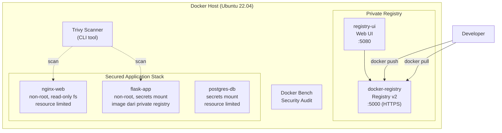

# MODUL 7: Docker Security, Secrets & Private Registry

**Topik:** Container Security Hardening, Docker Secrets, Image Scanning dengan Trivy, dan Private Registry dengan Docker Registry/Harbor  
**Durasi:** 120 menit  
**Prasyarat:** Modul 6 selesai (full monitoring stack berjalan), memahami Dockerfile dan Docker Compose

---

## 1. TUJUAN PEMBELAJARAN

Setelah praktikum ini, mahasiswa mampu:

1. Mengidentifikasi risiko keamanan umum pada deployment Docker (root container, hardcoded secrets, unverified images)
2. Menjalankan container sebagai **non-root user** dengan konfigurasi `USER` di Dockerfile
3. Mengelola kredensial sensitif menggunakan **Docker Secrets** sebagai pengganti environment variable plaintext
4. Melakukan **image scanning** dengan Trivy untuk mendeteksi CVE (Common Vulnerabilities and Exposures)
5. Men-deploy **Docker Registry** private sebagai container untuk hosting image internal
6. Melakukan push/pull image dari private registry
7. Mengamankan private registry dengan TLS dan basic authentication
8. Menerapkan resource limits (CPU, memory) dan read-only filesystem pada container
9. Menjalankan **Docker Bench for Security** untuk audit konfigurasi Docker host

---

## 2. DASAR TEORI

### 2.1 Attack Surface Docker

Container yang dikonfigurasi secara default memiliki beberapa kelemahan keamanan:

```
┌─────────────────────────────────────────────────────┐
│              RISIKO KEAMANAN DOCKER                  │
├─────────────────────────────────────────────────────┤
│                                                     │
│  1. Container berjalan sebagai ROOT                 │
│     → Jika escape, penyerang jadi root di host      │
│                                                     │
│  2. Password/API key hardcoded di compose/env       │
│     → Tersimpan di image layer, git history          │
│                                                     │
│  3. Image dari Docker Hub tanpa verifikasi          │
│     → Bisa mengandung malware/CVE                   │
│                                                     │
│  4. Container tanpa resource limit                  │
│     → Satu container bisa habiskan RAM/CPU host     │
│                                                     │
│  5. Writable filesystem di container                │
│     → Attacker bisa memodifikasi binary              │
│                                                     │
│  6. Docker socket exposed ke container              │
│     → Full control atas Docker daemon = root host   │
│                                                     │
└─────────────────────────────────────────────────────┘
```

### 2.2 Defense in Depth untuk Container

| Layer | Teknik | Tool |
|---|---|---|
| **Image** | Base image minimal, scan CVE, no secrets in layer | Alpine, Trivy, `.dockerignore` |
| **Build** | Multi-stage build, non-root USER, no latest tag | Dockerfile best practices |
| **Runtime** | Read-only fs, resource limits, drop capabilities | Docker Compose, seccomp |
| **Secrets** | Docker Secrets, vault, never in ENV/Dockerfile | Docker Swarm Secrets, `.env` file |
| **Network** | Internal network, no unnecessary port expose | Docker network, firewall |
| **Registry** | Private registry, signed images, access control | Docker Registry, Harbor |
| **Host** | Docker Bench, update daemon, non-root dockerd | Docker Bench for Security |

### 2.3 Docker Secrets

Docker Secrets menyimpan data sensitif (password, API key, certificate) secara terenkripsi dan hanya tersedia di dalam container sebagai file di `/run/secrets/<secret_name>`. Secret tidak pernah tersimpan di image layer atau environment variable yang bisa di-inspect.

```
┌─────────────────────────────────────┐
│          Docker Host                │
│                                     │
│  secret: db_password ──────────┐    │
│  (encrypted at rest)           │    │
│                                │    │
│  ┌──────────────────────┐      │    │
│  │     Container        │      │    │
│  │                      │      │    │
│  │  /run/secrets/       │◄─────┘    │
│  │    db_password       │ (tmpfs,   │
│  │    (plaintext file)  │  in-memory│
│  │                      │  only)    │
│  └──────────────────────┘           │
└─────────────────────────────────────┘
```

> **Catatan:** Docker Secrets secara native tersedia di Docker Swarm. Untuk Docker Compose standalone, kita menggunakan file-based secrets yang di-mount sebagai read-only file — mekanismenya berbeda tapi hasilnya serupa: password tidak lagi hardcoded di YAML.

### 2.4 Image Scanning

Image scanning menganalisis setiap layer dalam Docker image dan mencocokkan package yang terinstal dengan database CVE. **Trivy** (oleh Aqua Security) adalah scanner open-source yang populer karena ringan, cepat, dan mendukung banyak format.

### 2.5 Private Registry

Docker Registry adalah server HTTP yang menyimpan dan mendistribusikan Docker image. Menjalankan private registry memberikan kontrol penuh atas image: tidak bergantung koneksi internet, bisa enforce policy (hanya image yang sudah di-scan boleh di-push), dan menjaga intellectual property.

---

## 3. TOPOLOGI LAB



---

## 4. LANGKAH PRAKTIKUM

### Langkah 0: Persiapan Project

```bash
mkdir -p ~/docker-lab/security/{app,nginx,certs,auth,secrets,registry}
cd ~/docker-lab/security
```

---

### Langkah 1: Dockerfile Non-Root — Menghilangkan Root di Container

#### 1.1 Buat Flask app dengan non-root user

```bash
cat > app/requirements.txt << 'EOF'
flask==3.1.*
psycopg2-binary==2.9.*
EOF

cat > app/app.py << 'PYEOF'
import os, socket, datetime
from flask import Flask, jsonify

app = Flask(__name__)

def read_secret(name, default=""):
    """Baca secret dari /run/secrets/ (Docker Secrets) atau fallback ke env."""
    secret_path = f"/run/secrets/{name}"
    if os.path.exists(secret_path):
        with open(secret_path, "r") as f:
            return f.read().strip()
    return os.environ.get(name.upper(), default)

@app.route("/")
def index():
    return jsonify({
        "service": "flask-app-secured",
        "hostname": socket.gethostname(),
        "user": os.getenv("USER", "unknown"),
        "uid": os.getuid(),
        "timestamp": datetime.datetime.now().isoformat()
    })

@app.route("/api/health")
def health():
    import psycopg2
    try:
        conn = psycopg2.connect(
            host=read_secret("db_host", "postgres-db"),
            dbname=read_secret("db_name", "labdb"),
            user=read_secret("db_user", "labuser"),
            password=read_secret("db_password", ""))
        cur = conn.cursor()
        cur.execute("SELECT version();")
        ver = cur.fetchone()[0]
        cur.close(); conn.close()
        return jsonify({"status": "ok", "database": ver, "secrets_method": "file-based"})
    except Exception as e:
        return jsonify({"status": "error", "detail": str(e)}), 500

if __name__ == "__main__":
    app.run(host="0.0.0.0", port=5000)
PYEOF
```

#### 1.2 Buat Dockerfile INSECURE (untuk perbandingan)

```bash
cat > app/Dockerfile.insecure << 'EOF'
# ============================================
# INSECURE Dockerfile — JANGAN pakai di production!
# Berjalan sebagai root, tidak ada .dockerignore
# ============================================
FROM python:3.11
WORKDIR /app
COPY . .
RUN pip install -r requirements.txt
# Tidak ada USER directive → berjalan sebagai root (UID 0)
EXPOSE 5000
CMD ["python", "app.py"]
EOF
```

#### 1.3 Buat Dockerfile SECURE (best practices)

```bash
cat > app/Dockerfile << 'EOF'
# ============================================
# SECURE Dockerfile — Production Best Practices
# ============================================

# --- Stage 1: Build dependencies ---
FROM python:3.11-slim AS builder
WORKDIR /build
COPY requirements.txt .
RUN pip install --no-cache-dir --prefix=/install -r requirements.txt

# --- Stage 2: Production image ---
FROM python:3.11-slim

# Metadata
LABEL maintainer="admin@pens.ac.id"
LABEL description="Secured Flask App — PENS Docker Lab"

# Buat non-root user
RUN groupadd -r appuser && useradd -r -g appuser -d /app -s /sbin/nologin appuser

# Copy dependencies dari builder stage (multi-stage build)
COPY --from=builder /install /usr/local

# Setup application
WORKDIR /app
COPY --chown=appuser:appuser app.py .

# Switch ke non-root user
USER appuser

# Expose port > 1024 (non-privileged port)
EXPOSE 5000

# Health check
HEALTHCHECK --interval=30s --timeout=5s --retries=3 \
    CMD python -c "import urllib.request; urllib.request.urlopen('http://localhost:5000/')" || exit 1

CMD ["python", "app.py"]
EOF
```

#### 1.4 Buat `.dockerignore`

```bash
cat > app/.dockerignore << 'EOF'
Dockerfile*
.git
.gitignore
__pycache__
*.pyc
.env
*.md
.dockerignore
docker-compose*.yml
EOF
```

#### 1.5 Bandingkan image secure vs insecure

```bash
# Build kedua image
docker build -t flask-insecure:1.0 -f app/Dockerfile.insecure app/
docker build -t flask-secure:1.0 -f app/Dockerfile app/

# Bandingkan ukuran
docker images | grep flask-

# Cek user di container insecure
docker run --rm flask-insecure:1.0 whoami
docker run --rm flask-insecure:1.0 id
# Output: root, uid=0(root) ← BERBAHAYA

# Cek user di container secure
docker run --rm flask-secure:1.0 whoami
docker run --rm flask-secure:1.0 id
# Output: appuser, uid=999(appuser) ← AMAN

# Cek jumlah layer
docker image history flask-insecure:1.0
docker image history flask-secure:1.0
```

---

### Langkah 2: Docker Secrets (File-Based untuk Compose)

#### 2.1 Buat file secret

```bash
# Buat file secret untuk setiap credential
echo "labuser" > secrets/db_user
echo "SecureP@ss2025!" > secrets/db_password
echo "labdb" > secrets/db_name
echo "postgres-db" > secrets/db_host

# Set permission ketat
chmod 600 secrets/*

ls -la secrets/
```

#### 2.2 Verifikasi bahwa secret tidak ada di image layer

```bash
# Build image secure
docker build -t flask-secure:1.0 app/

# Cek apakah ada password di image layer (harus TIDAK ADA)
docker image history flask-secure:1.0
docker image inspect flask-secure:1.0 | grep -i password
# Tidak ada output → password tidak tersimpan di image

# Bandingkan: cek image yang pakai ENV (dari modul sebelumnya)
# docker inspect <image-lama> | grep -i password
# Bisa terlihat di environment variable → TIDAK AMAN
```

---

### Langkah 3: Image Scanning dengan Trivy

#### 3.1 Instal Trivy

```bash
# Download dan instal Trivy
curl -sfL https://raw.githubusercontent.com/aquasecurity/trivy/main/contrib/install.sh | \
    sudo sh -s -- -b /usr/local/bin

# Verifikasi
trivy version
```

#### 3.2 Scan image untuk CVE

```bash
# Scan image insecure (base: python:3.11 full — banyak package)
trivy image flask-insecure:1.0

# Scan image secure (base: python:3.11-slim — lebih sedikit package)
trivy image flask-secure:1.0

# Scan dengan filter severity HIGH dan CRITICAL saja
trivy image --severity HIGH,CRITICAL flask-secure:1.0

# Scan image pihak ketiga
trivy image nginx:alpine
trivy image postgres:16-alpine
trivy image grafana/grafana:latest
```

#### 3.3 Analisis hasil scan

```bash
# Output format tabel — simpan ke file
trivy image --severity HIGH,CRITICAL --format table flask-insecure:1.0 > /tmp/scan-insecure.txt
trivy image --severity HIGH,CRITICAL --format table flask-secure:1.0 > /tmp/scan-secure.txt

# Bandingkan jumlah CVE
echo "=== INSECURE ==="
grep -c "^│" /tmp/scan-insecure.txt 2>/dev/null || echo "Lihat output manual"
echo "=== SECURE ==="
grep -c "^│" /tmp/scan-secure.txt 2>/dev/null || echo "Lihat output manual"

# Output format JSON (untuk automasi CI/CD di Modul 8)
trivy image --format json --output /tmp/scan-result.json flask-secure:1.0
```

#### 3.4 Scan Dockerfile untuk misconfiguration

```bash
# Trivy bisa scan Dockerfile langsung (tanpa build)
trivy config app/Dockerfile
trivy config app/Dockerfile.insecure
```

---

### Langkah 4: Deploy Private Docker Registry

#### 4.1 Generate TLS certificate untuk registry

```bash
# Self-signed cert untuk registry.lab
openssl req -x509 -nodes -days 365 \
    -newkey rsa:2048 \
    -keyout certs/registry.key \
    -out certs/registry.crt \
    -subj "/C=ID/ST=Jawa Timur/L=Surabaya/O=PENS Lab/CN=registry.lab" \
    -addext "subjectAltName=DNS:registry.lab,DNS:localhost,IP:127.0.0.1"
```

#### 4.2 Buat basic authentication

```bash
# Install htpasswd (dari apache2-utils)
sudo apt install -y apache2-utils

# Buat file htpasswd
htpasswd -Bbn admin registry123 > auth/htpasswd
htpasswd -Bbn student student123 >> auth/htpasswd

cat auth/htpasswd
```

#### 4.3 Docker Compose untuk registry

```bash
cat > docker-compose.registry.yml << 'EOF'
services:
  # --- Private Docker Registry ---
  registry:
    image: registry:2
    container_name: docker-registry
    ports:
      - "5000:5000"
    environment:
      REGISTRY_AUTH: htpasswd
      REGISTRY_AUTH_HTPASSWD_REALM: "PENS Docker Registry"
      REGISTRY_AUTH_HTPASSWD_PATH: /auth/htpasswd
      REGISTRY_HTTP_TLS_CERTIFICATE: /certs/registry.crt
      REGISTRY_HTTP_TLS_KEY: /certs/registry.key
      REGISTRY_STORAGE_DELETE_ENABLED: "true"
    volumes:
      - registry-data:/var/lib/registry
      - ./certs:/certs:ro
      - ./auth:/auth:ro
    restart: unless-stopped

  # --- Registry Web UI ---
  registry-ui:
    image: joxit/docker-registry-ui:latest
    container_name: registry-ui
    ports:
      - "5080:80"
    environment:
      REGISTRY_TITLE: "PENS Private Registry"
      REGISTRY_URL: "https://registry:5000"
      SINGLE_REGISTRY: "true"
      DELETE_IMAGES: "true"
      NGINX_PROXY_PASS_URL: "https://registry:5000"
    depends_on:
      - registry
    restart: unless-stopped

volumes:
  registry-data:
EOF
```

#### 4.4 Konfigurasi trust certificate di host

```bash
# Tambahkan DNS lokal
echo "127.0.0.1 registry.lab" | sudo tee -a /etc/hosts

# Trust self-signed cert agar Docker daemon mau push/pull
sudo mkdir -p /usr/local/share/ca-certificates/
sudo cp certs/registry.crt /usr/local/share/ca-certificates/registry-lab.crt
sudo update-ca-certificates

# Tambahkan juga ke Docker daemon config (alternatif)
sudo mkdir -p /etc/docker/certs.d/registry.lab:5000/
sudo cp certs/registry.crt /etc/docker/certs.d/registry.lab:5000/ca.crt

# Restart Docker daemon
sudo systemctl restart docker
```

#### 4.5 Deploy dan test registry

```bash
# Jalankan registry
docker compose -f docker-compose.registry.yml up -d

# Login ke private registry
docker login registry.lab:5000 -u admin -p registry123

# Tag image lokal untuk private registry
docker tag flask-secure:1.0 registry.lab:5000/pens/flask-app:1.0
docker tag nginx:alpine registry.lab:5000/pens/nginx:alpine

# Push ke private registry
docker push registry.lab:5000/pens/flask-app:1.0
docker push registry.lab:5000/pens/nginx:alpine

# Verifikasi — list image di registry via API
curl -k -u admin:registry123 https://registry.lab:5000/v2/_catalog | python3 -m json.tool

# List tags untuk image tertentu
curl -k -u admin:registry123 https://registry.lab:5000/v2/pens/flask-app/tags/list | python3 -m json.tool

# Test pull — hapus image lokal dulu, lalu pull dari registry
docker rmi registry.lab:5000/pens/flask-app:1.0
docker pull registry.lab:5000/pens/flask-app:1.0
```

#### 4.6 Akses Registry Web UI

Buka browser: `http://localhost:5080` → terlihat daftar image yang sudah di-push.

---

### Langkah 5: Resource Limits & Read-Only Filesystem

#### 5.1 Buat Nginx config

```bash
cat > nginx/default.conf << 'EOF'
server {
    listen 8080;
    location / {
        root /usr/share/nginx/html;
        index index.html;
    }
    location /api/ {
        proxy_pass http://flask-app:5000;
        proxy_set_header Host $host;
        proxy_set_header X-Real-IP $remote_addr;
    }
}
EOF

cat > nginx/index.html << 'EOF'
<!DOCTYPE html>
<html><head><title>Secured Docker Stack</title>
<style>body{font-family:sans-serif;text-align:center;padding:50px;background:#1b5e20;color:white;}
.box{background:rgba(255,255,255,0.1);padding:30px;border-radius:12px;max-width:500px;margin:0 auto;}</style>
</head><body><div class="box">
<h1>🔒 Secured Docker Stack</h1>
<p>Non-root containers, secrets-based auth, scanned images</p>
<button onclick="fetch('/api/health').then(r=>r.json()).then(d=>document.getElementById('r').textContent=JSON.stringify(d,null,2))">Test Backend</button>
<pre id="r">Klik untuk test...</pre>
</div></body></html>
EOF
```

#### 5.2 Docker Compose — Secured Application Stack

```bash
cat > docker-compose.yml << 'EOF'
secrets:
  db_user:
    file: ./secrets/db_user
  db_password:
    file: ./secrets/db_password
  db_name:
    file: ./secrets/db_name
  db_host:
    file: ./secrets/db_host

services:
  # --- Nginx (non-root, read-only, resource limited) ---
  nginx-web:
    image: nginx:alpine
    container_name: nginx-secured
    ports:
      - "8080:8080"
    volumes:
      - ./nginx/default.conf:/etc/nginx/conf.d/default.conf:ro
      - ./nginx/index.html:/usr/share/nginx/html/index.html:ro
      - nginx-cache:/var/cache/nginx       # writable cache
      - nginx-run:/var/run                  # writable pid
    read_only: true                         # filesystem read-only
    tmpfs:
      - /tmp:size=10m                       # writable tmp
    deploy:
      resources:
        limits:
          cpus: "0.5"
          memory: 128M
        reservations:
          cpus: "0.1"
          memory: 32M
    security_opt:
      - no-new-privileges:true
    networks:
      - app-net
    depends_on:
      - flask-app
    restart: unless-stopped

  # --- Flask App (non-root, secrets, resource limited) ---
  flask-app:
    image: registry.lab:5000/pens/flask-app:1.0
    container_name: flask-secured
    secrets:
      - db_user
      - db_password
      - db_name
      - db_host
    deploy:
      resources:
        limits:
          cpus: "0.5"
          memory: 256M
        reservations:
          cpus: "0.1"
          memory: 64M
    security_opt:
      - no-new-privileges:true
    networks:
      - app-net
      - db-net
    depends_on:
      db:
        condition: service_healthy
    restart: unless-stopped

  # --- PostgreSQL (secrets, resource limited) ---
  db:
    image: postgres:16-alpine
    container_name: postgres-secured
    environment:
      POSTGRES_USER_FILE: /run/secrets/db_user
      POSTGRES_PASSWORD_FILE: /run/secrets/db_password
      POSTGRES_DB_FILE: /run/secrets/db_name
      TZ: Asia/Jakarta
    secrets:
      - db_user
      - db_password
      - db_name
    volumes:
      - pg-data:/var/lib/postgresql/data
    deploy:
      resources:
        limits:
          cpus: "1.0"
          memory: 512M
        reservations:
          cpus: "0.25"
          memory: 128M
    security_opt:
      - no-new-privileges:true
    networks:
      - db-net
    healthcheck:
      test: ["CMD-SHELL", "pg_isready -U $$(cat /run/secrets/db_user)"]
      interval: 10s
      timeout: 5s
      retries: 5
    restart: unless-stopped

volumes:
  pg-data:
  nginx-cache:
  nginx-run:

networks:
  app-net:
  db-net:
    internal: true      # db-net TIDAK bisa diakses dari luar
EOF
```

#### 5.3 Deploy dan verifikasi

```bash
docker compose up -d
docker compose ps

# Test aplikasi
curl http://localhost:8080
curl http://localhost:8080/api/health | python3 -m json.tool

# Verifikasi non-root
docker exec flask-secured whoami        # appuser (bukan root)
docker exec flask-secured id            # uid=999
docker exec nginx-secured whoami        # nginx (bukan root di image alpine)

# Verifikasi secrets mount
docker exec flask-secured ls -la /run/secrets/
docker exec flask-secured cat /run/secrets/db_user     # labuser
docker exec postgres-secured ls -la /run/secrets/

# Verifikasi read-only filesystem (Nginx)
docker exec nginx-secured touch /test-file 2>&1
# Output: touch: /test-file: Read-only file system ← BERHASIL

# Verifikasi resource limits
docker stats --no-stream --format "table {{.Name}}\t{{.CPUPerc}}\t{{.MemUsage}}\t{{.MemPerc}}"

# Verifikasi bahwa password TIDAK ada di inspect
docker inspect flask-secured | grep -i password
# Tidak ada output → secret tidak bocor di metadata

# Verifikasi internal network
docker exec nginx-secured ping -c 1 postgres-secured 2>&1
# GAGAL — nginx tidak bisa reach db (beda network, db-net internal)
docker exec flask-secured ping -c 1 postgres-secured
# BERHASIL — flask ada di db-net
```

---

### Langkah 6: Docker Bench for Security

```bash
# Jalankan Docker Bench for Security
docker run --rm --net host --pid host \
    --userns host --cap-add audit_control \
    -v /etc:/etc:ro \
    -v /usr/bin/containerd:/usr/bin/containerd:ro \
    -v /usr/bin/runc:/usr/bin/runc:ro \
    -v /usr/lib/systemd:/usr/lib/systemd:ro \
    -v /var/lib:/var/lib:ro \
    -v /var/run/docker.sock:/var/run/docker.sock:ro \
    docker/docker-bench-security 2>&1 | tee /tmp/bench-result.txt

# Lihat summary
echo ""
echo "=== SUMMARY ==="
grep -E "^\[INFO\]|^\[WARN\]|^\[PASS\]" /tmp/bench-result.txt | tail -20
```

Perhatikan perbedaan hasil audit antara container yang sudah di-hardening (secured stack) vs yang belum.

---

## 5. PERTANYAAN

### Pre-Lab

1. Mengapa menjalankan container sebagai root berbahaya? Jelaskan skenario container escape.
2. Apa perbedaan antara menyimpan password di environment variable vs Docker Secret?
3. Apa itu CVE dan mengapa penting untuk melakukan image scanning sebelum deployment?
4. Jelaskan keuntungan multi-stage build dari sisi keamanan dan ukuran image.
5. Mengapa private registry penting di lingkungan enterprise?

### Post-Lab

1. Bandingkan jumlah CVE pada `flask-insecure:1.0` vs `flask-secure:1.0`. Apa penyebab perbedaannya?
2. Tunjukkan bahwa password tidak terlihat di `docker inspect flask-secured`. Bandingkan dengan container yang pakai environment variable biasa.
3. Apa yang terjadi jika mencoba menulis file ke filesystem container Nginx yang read-only? Tunjukkan error message-nya.
4. Jelaskan mengapa network `db-net` diberi flag `internal: true`. Apa efeknya terhadap keamanan?
5. Dari output Docker Bench for Security, sebutkan 3 temuan WARN dan jelaskan cara memperbaikinya.

---

## 6. CHECKLIST

- [ ] Dockerfile secure menggunakan non-root USER — `docker exec flask-secured whoami` = `appuser`
- [ ] Multi-stage build — image secure lebih kecil dari insecure
- [ ] `.dockerignore` ada — file sensitif tidak masuk ke image
- [ ] Trivy terinstal — `trivy version` menampilkan versi
- [ ] Image scan berhasil — output CVE untuk `flask-insecure` dan `flask-secure`
- [ ] Dockerfile scan berhasil — `trivy config` mendeteksi misconfiguration
- [ ] Private registry running — `curl -k https://registry.lab:5000/v2/_catalog` menampilkan daftar
- [ ] Push/pull ke registry berhasil — image `pens/flask-app:1.0` ada di registry
- [ ] Registry UI bisa diakses — `http://localhost:5080` menampilkan daftar image
- [ ] Docker Secrets berfungsi — `/run/secrets/` berisi file secret di container
- [ ] PostgreSQL baca password dari secret file — `POSTGRES_PASSWORD_FILE` digunakan
- [ ] Read-only filesystem Nginx — `touch` gagal dengan error read-only
- [ ] Resource limits aktif — `docker stats` menampilkan limit memory
- [ ] Internal network — Nginx tidak bisa ping PostgreSQL
- [ ] Docker Bench dijalankan — output tersimpan

---

## 7. TABEL TROUBLESHOOTING

| **Gejala** | **Kemungkinan Cause** | **Solusi** |
|---|---|---|
| `docker push` error x509/certificate | Docker daemon tidak trust cert registry | Copy cert ke `/etc/docker/certs.d/registry.lab:5000/ca.crt`, restart Docker |
| `docker login` unauthorized | Username/password salah | Cek `auth/htpasswd`, regenerate dengan `htpasswd -Bbn` |
| Flask `permission denied` baca file | File owned by root, container jalan sebagai appuser | Tambah `--chown=appuser:appuser` di `COPY` Dockerfile |
| Nginx gagal start (read-only) | Cache/PID directory tidak writable | Mount volume untuk `/var/cache/nginx` dan `/var/run` |
| `POSTGRES_PASSWORD_FILE` diabaikan | File secret belum di-mount atau path salah | Cek `secrets:` di compose dan path `/run/secrets/db_password` |
| Trivy download DB lambat | Database CVE besar (~500MB pertama kali) | Tunggu selesai atau gunakan `--skip-db-update` setelah download pertama |
| Container OOM killed | Memory limit terlalu kecil | Naikkan `memory` limit di `deploy.resources.limits` |
| Registry data hilang | Volume `registry-data` dihapus | Jangan gunakan `docker compose down -v` untuk registry |
| Docker Bench error `/usr/bin/containerd` not found | Path containerd berbeda di distro tertentu | Sesuaikan volume mount, atau skip audit tersebut |
| Nginx tidak bisa reach Flask (502) | Network misconfiguration | Pastikan keduanya ada di `app-net` |

---

## 8. FORMAT LAPORAN

Submit via LMS dalam **satu file PDF (max 8 halaman)**:

**Halaman 1:** Cover

**Halaman 2–6:** Screenshot Wajib (14 screenshot):
1. `docker run --rm flask-insecure:1.0 id` — UID 0 (root)
2. `docker run --rm flask-secure:1.0 id` — UID 999 (appuser)
3. `docker images | grep flask` — perbandingan ukuran insecure vs secure
4. `trivy image flask-insecure:1.0` — output CVE (banyak)
5. `trivy image flask-secure:1.0` — output CVE (sedikit)
6. `trivy config app/Dockerfile.insecure` — misconfiguration detected
7. `docker login registry.lab:5000` — login berhasil
8. `docker push registry.lab:5000/pens/flask-app:1.0` — push berhasil
9. `curl -k https://registry.lab:5000/v2/_catalog` — daftar image di registry
10. Registry Web UI — `http://localhost:5080`
11. `docker exec flask-secured ls -la /run/secrets/` — secret files
12. `docker exec nginx-secured touch /test-file` — error read-only
13. `docker stats --no-stream` — resource limits terlihat
14. Docker Bench for Security — summary output

**Halaman 7–8:** Jawaban Post-Lab

---

## 9. REFERENSI

1. Docker, Inc. (2025). Docker Security Best Practices. https://docs.docker.com/develop/security-best-practices/
2. Docker, Inc. (2025). Manage Sensitive Data with Docker Secrets. https://docs.docker.com/engine/swarm/secrets/
3. Docker, Inc. (2025). Deploy a Registry Server. https://docs.docker.com/registry/deploying/
4. Aqua Security. (2025). Trivy — Comprehensive Security Scanner. https://trivy.dev/
5. Docker, Inc. (2025). Docker Bench for Security. https://github.com/docker/docker-bench-security
6. NIST. (2025). Application Container Security Guide (SP 800-190). https://csrc.nist.gov/publications/detail/sp/800-190/final
7. CIS. (2025). CIS Docker Benchmark. https://www.cisecurity.org/benchmark/docker

---

> **Durasi:** 120 menit | **Difficulty:** Advanced  
> **Previous:** Modul 6 — Grafana Monitoring  
> **Next:** Modul 8 — Keycloak Identity & Access Management
