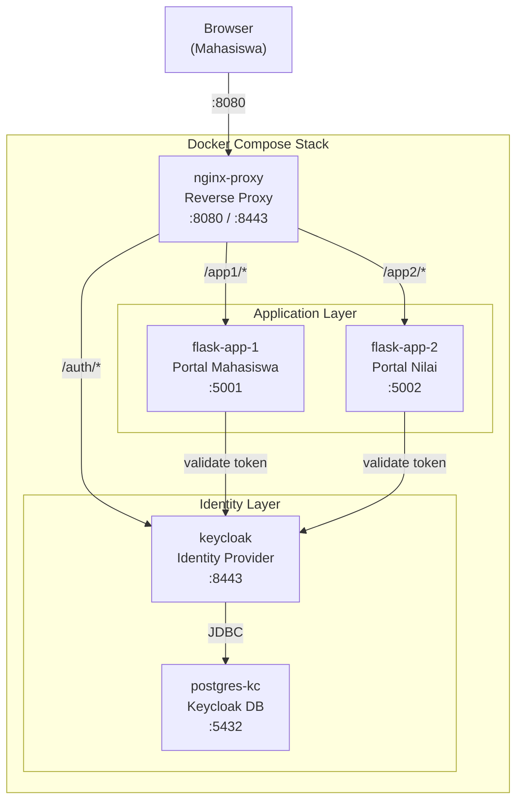

# MODUL 8: Keycloak — Identity & Access Management di Docker

**Topik:** Deployment Keycloak sebagai Identity Provider (IdP), OAuth2 / OpenID Connect, Single Sign-On (SSO), dan Proteksi Aplikasi Web  
**Durasi:** 120 menit  
**Prasyarat:** Modul 7 selesai (memahami Docker Secrets, TLS certificate, private registry)

---

## 1. TUJUAN PEMBELAJARAN

Setelah praktikum ini, mahasiswa mampu:

1. Memahami konsep Identity & Access Management (IAM): autentikasi vs otorisasi
2. Men-deploy **Keycloak** sebagai Identity Provider dalam container Docker dengan PostgreSQL backend
3. Mengkonfigurasi **Realm**, **Client**, **User**, dan **Role** melalui Keycloak Admin Console
4. Memahami alur **OAuth 2.0 Authorization Code Flow** dan **OpenID Connect (OIDC)**
5. Mengintegrasikan Keycloak dengan aplikasi **Flask** untuk login berbasis token
6. Mengkonfigurasi **Nginx** sebagai reverse proxy dengan validasi token Keycloak
7. Mengimplementasikan **Role-Based Access Control (RBAC)** pada endpoint API
8. Menerapkan **Single Sign-On (SSO)** antar dua aplikasi yang berbeda
9. Mengelola session, token lifetime, dan logout flow

---

## 2. DASAR TEORI

### 2.1 Autentikasi vs Otorisasi

| Aspek | Autentikasi (AuthN) | Otorisasi (AuthZ) |
|---|---|---|
| Pertanyaan | "Siapa kamu?" | "Apa yang boleh kamu lakukan?" |
| Mekanisme | Username/password, token, certificate | Role, permission, policy |
| Waktu | Dilakukan pertama | Setelah autentikasi berhasil |
| Contoh | Login form, OAuth2 login | Admin bisa hapus user, viewer hanya bisa baca |

### 2.2 Keycloak Overview

**Keycloak** adalah platform open-source Identity and Access Management (IAM) yang dikembangkan oleh Red Hat. Keycloak menyediakan fitur enterprise-grade: Single Sign-On (SSO), identity brokering, user federation (LDAP/AD), social login, dan fine-grained authorization.

**Konsep utama Keycloak:**

| Konsep | Deskripsi |
|---|---|
| **Realm** | Tenant terisolasi — semua konfigurasi (user, client, role) berada dalam satu realm |
| **Client** | Aplikasi yang terdaftar dan ingin menggunakan Keycloak untuk autentikasi |
| **User** | Entitas yang melakukan login (mahasiswa, admin, dll.) |
| **Role** | Hak akses yang diberikan ke user (realm role atau client role) |
| **Group** | Kumpulan user yang bisa di-assign role secara batch |
| **Identity Provider** | Keycloak bertindak sebagai IdP, atau bisa broker ke IdP lain (Google, GitHub) |
| **Token** | JWT (JSON Web Token) yang berisi identitas dan role user |

### 2.3 OAuth 2.0 Authorization Code Flow

Ini adalah alur yang paling umum dan aman untuk web application:

```
     Browser                 Flask App               Keycloak
        │                       │                       │
   1.   │── GET /dashboard ────►│                       │
        │                       │── 302 Redirect ──────►│
   2.   │◄── Redirect to ──────┤  /auth?client_id=...  │
        │    Keycloak login     │                       │
   3.   │── Login form ────────────────────────────────►│
        │   (user + password)   │                       │
   4.   │◄── 302 + auth code ──────────────────────────┤
        │    /callback?code=ABC │                       │
   5.   │── GET /callback ─────►│                       │
        │    ?code=ABC          │── POST /token ───────►│
   6.   │                       │   (code + secret)     │
        │                       │◄── Access Token ──────┤
        │                       │    + Refresh Token     │
   7.   │◄── 200 Dashboard ────┤   (JWT berisi roles)  │
        │    (authenticated)    │                       │
```

### 2.4 JWT (JSON Web Token)

Token yang dikeluarkan Keycloak berformat JWT dan berisi informasi user, role, dan metadata:

```
Header.Payload.Signature

Payload (decoded):
{
  "sub": "user-uuid-123",
  "preferred_username": "ahmad",
  "email": "ahmad@student.pens.ac.id",
  "realm_access": {
    "roles": ["student", "lab-user"]
  },
  "resource_access": {
    "flask-app": {
      "roles": ["viewer", "editor"]
    }
  },
  "exp": 1717200000,
  "iat": 1717196400
}
```

### 2.5 Arsitektur Lab

```
┌─────────────────────────────────────────────────────────┐
│                    Docker Compose Stack                   │
│                                                          │
│  ┌────────────┐       ┌─────────────────────────────┐   │
│  │   Nginx    │──────►│       Keycloak              │   │
│  │  Reverse   │  ↑    │   Identity Provider         │   │
│  │  Proxy     │  │    │   Port: 8443 (HTTPS)        │   │
│  │  :443/:80  │  │    │   Admin: admin/admin123     │   │
│  └─────┬──────┘  │    └──────────┬──────────────────┘   │
│        │         │               │                       │
│        │ SSO     │ Token         │ JDBC                  │
│        │ Login   │ Validate      │                       │
│   ┌────▼─────┐   │    ┌─────────▼───────────┐           │
│   │ Flask    │   │    │    PostgreSQL        │           │
│   │ App-1    │───┘    │    (Keycloak DB)     │           │
│   │ :5001    │        │    :5432             │           │
│   └──────────┘        └─────────────────────┘           │
│   ┌──────────┐                                           │
│   │ Flask    │── SSO via same Realm                      │
│   │ App-2    │                                           │
│   │ :5002    │                                           │
│   └──────────┘                                           │
└─────────────────────────────────────────────────────────┘
```

---

## 3. TOPOLOGI LAB



---

## 4. LANGKAH PRAKTIKUM

### Langkah 0: Persiapan Project

```bash
mkdir -p ~/docker-lab/keycloak/{nginx,app1,app2,certs,secrets}
cd ~/docker-lab/keycloak
```

---

### Langkah 1: Generate TLS Certificate

```bash
openssl req -x509 -nodes -days 365 \
    -newkey rsa:2048 \
    -keyout certs/server.key \
    -out certs/server.crt \
    -subj "/C=ID/ST=Jawa Timur/L=Surabaya/O=PENS Lab/CN=auth.lab" \
    -addext "subjectAltName=DNS:auth.lab,DNS:app1.lab,DNS:app2.lab,DNS:localhost"

echo "127.0.0.1 auth.lab app1.lab app2.lab" | sudo tee -a /etc/hosts
```

---

### Langkah 2: Buat Secrets

```bash
echo "keycloakdb" > secrets/kc_db_name
echo "keycloakuser" > secrets/kc_db_user
echo "KcDBp@ss2025" > secrets/kc_db_password
echo "admin" > secrets/kc_admin_user
echo "admin123" > secrets/kc_admin_password
chmod 600 secrets/*
```

---

### Langkah 3: Docker Compose

```bash
cat > docker-compose.yml << 'EOF'
secrets:
  kc_db_name:
    file: ./secrets/kc_db_name
  kc_db_user:
    file: ./secrets/kc_db_user
  kc_db_password:
    file: ./secrets/kc_db_password
  kc_admin_user:
    file: ./secrets/kc_admin_user
  kc_admin_password:
    file: ./secrets/kc_admin_password

services:

  # ============================================
  # IDENTITY PROVIDER: Keycloak
  # ============================================
  keycloak:
    image: quay.io/keycloak/keycloak:latest
    container_name: keycloak
    command: start-dev
    environment:
      # Admin credentials
      KEYCLOAK_ADMIN_FILE: /run/secrets/kc_admin_user
      KEYCLOAK_ADMIN_PASSWORD_FILE: /run/secrets/kc_admin_password
      # Fallback (Keycloak belum support semua _FILE env)
      KEYCLOAK_ADMIN: admin
      KEYCLOAK_ADMIN_PASSWORD: admin123
      # Database
      KC_DB: postgres
      KC_DB_URL_HOST: postgres-kc
      KC_DB_URL_PORT: 5432
      KC_DB_URL_DATABASE: keycloakdb
      KC_DB_USERNAME: keycloakuser
      KC_DB_PASSWORD: KcDBp@ss2025
      # Proxy & hostname
      KC_PROXY_HEADERS: xforwarded
      KC_HTTP_ENABLED: "true"
      KC_HTTP_PORT: 8080
      KC_HOSTNAME_STRICT: "false"
      # Timezone
      TZ: Asia/Jakarta
    secrets:
      - kc_admin_user
      - kc_admin_password
    ports:
      - "8180:8080"
    networks:
      - kc-net
    depends_on:
      postgres-kc:
        condition: service_healthy
    healthcheck:
      test: ["CMD-SHELL", "exec 3<>/dev/tcp/127.0.0.1/8080; echo -e 'GET /health/ready HTTP/1.1\r\nHost: localhost\r\n\r\n' >&3; cat <&3 | grep -q 'UP'"]
      interval: 15s
      timeout: 10s
      retries: 10
      start_period: 60s
    restart: unless-stopped

  # ============================================
  # DATABASE: PostgreSQL untuk Keycloak
  # ============================================
  postgres-kc:
    image: postgres:16-alpine
    container_name: postgres-kc
    environment:
      POSTGRES_DB: keycloakdb
      POSTGRES_USER: keycloakuser
      POSTGRES_PASSWORD: KcDBp@ss2025
      TZ: Asia/Jakarta
    volumes:
      - kc-pg-data:/var/lib/postgresql/data
    networks:
      - kc-net
    healthcheck:
      test: ["CMD-SHELL", "pg_isready -U keycloakuser -d keycloakdb"]
      interval: 10s
      timeout: 5s
      retries: 5
    restart: unless-stopped

  # ============================================
  # APPLICATION 1: Portal Mahasiswa (Flask)
  # ============================================
  flask-app-1:
    build: ./app1
    container_name: flask-app-1
    environment:
      - APP_NAME=Portal Mahasiswa
      - APP_PORT=5001
      - KEYCLOAK_URL=http://keycloak:8080
      - KEYCLOAK_EXTERNAL_URL=http://localhost:8180
      - KEYCLOAK_REALM=pens-lab
      - KEYCLOAK_CLIENT_ID=flask-app-1
      - KEYCLOAK_CLIENT_SECRET=flask-app-1-secret
    ports:
      - "5001:5001"
    networks:
      - kc-net
    depends_on:
      keycloak:
        condition: service_healthy
    restart: unless-stopped

  # ============================================
  # APPLICATION 2: Portal Nilai (Flask)
  # ============================================
  flask-app-2:
    build: ./app2
    container_name: flask-app-2
    environment:
      - APP_NAME=Portal Nilai
      - APP_PORT=5002
      - KEYCLOAK_URL=http://keycloak:8080
      - KEYCLOAK_EXTERNAL_URL=http://localhost:8180
      - KEYCLOAK_REALM=pens-lab
      - KEYCLOAK_CLIENT_ID=flask-app-2
      - KEYCLOAK_CLIENT_SECRET=flask-app-2-secret
    ports:
      - "5002:5002"
    networks:
      - kc-net
    depends_on:
      keycloak:
        condition: service_healthy
    restart: unless-stopped

volumes:
  kc-pg-data:

networks:
  kc-net:
EOF
```

---

### Langkah 4: Buat Flask Application 1 — Portal Mahasiswa

```bash
cat > app1/requirements.txt << 'EOF'
flask==3.1.*
requests==2.32.*
PyJWT==2.9.*
cryptography==44.*
EOF

cat > app1/app.py << 'PYEOF'
"""
Flask App 1 — Portal Mahasiswa
Dilindungi oleh Keycloak OAuth2 / OIDC.
"""
import os, json, time, secrets
from functools import wraps
from urllib.parse import urlencode
import requests, jwt
from flask import Flask, jsonify, request, redirect, session, url_for, make_response

app = Flask(__name__)
app.secret_key = secrets.token_hex(32)

# --- Konfigurasi Keycloak ---
KC_URL         = os.environ.get("KEYCLOAK_URL", "http://keycloak:8080")
KC_EXT_URL     = os.environ.get("KEYCLOAK_EXTERNAL_URL", "http://localhost:8180")
REALM          = os.environ.get("KEYCLOAK_REALM", "pens-lab")
CLIENT_ID      = os.environ.get("KEYCLOAK_CLIENT_ID", "flask-app-1")
CLIENT_SECRET  = os.environ.get("KEYCLOAK_CLIENT_SECRET", "flask-app-1-secret")
APP_NAME       = os.environ.get("APP_NAME", "Portal Mahasiswa")
APP_PORT       = int(os.environ.get("APP_PORT", 5001))

# OIDC Endpoints
OIDC_BASE      = f"{KC_URL}/realms/{REALM}/protocol/openid-connect"
OIDC_EXT_BASE  = f"{KC_EXT_URL}/realms/{REALM}/protocol/openid-connect"
AUTH_URL        = f"{OIDC_EXT_BASE}/auth"
TOKEN_URL       = f"{OIDC_BASE}/token"
USERINFO_URL    = f"{OIDC_BASE}/userinfo"
LOGOUT_URL      = f"{OIDC_EXT_BASE}/logout"
CERTS_URL       = f"{OIDC_BASE}/certs"

# Cache JWKS (public keys untuk verifikasi token)
_jwks_cache = {"keys": None, "fetched_at": 0}

def get_jwks():
    """Ambil JWKS dari Keycloak (cache 5 menit)."""
    if _jwks_cache["keys"] and time.time() - _jwks_cache["fetched_at"] < 300:
        return _jwks_cache["keys"]
    try:
        resp = requests.get(CERTS_URL, timeout=5)
        _jwks_cache["keys"] = resp.json()
        _jwks_cache["fetched_at"] = time.time()
        return _jwks_cache["keys"]
    except Exception:
        return _jwks_cache["keys"]

def decode_token(token):
    """Decode dan verifikasi JWT access token."""
    jwks = get_jwks()
    if not jwks:
        return None
    try:
        header = jwt.get_unverified_header(token)
        key = None
        for k in jwks.get("keys", []):
            if k["kid"] == header["kid"]:
                key = jwt.algorithms.RSAAlgorithm.from_jwk(json.dumps(k))
                break
        if not key:
            return None
        return jwt.decode(token, key, algorithms=["RS256"],
                         audience="account",
                         options={"verify_exp": True})
    except Exception as e:
        app.logger.error(f"Token decode error: {e}")
        return None

def login_required(f):
    """Decorator: redirect ke Keycloak jika belum login."""
    @wraps(f)
    def decorated(*args, **kwargs):
        if "access_token" not in session:
            # Simpan halaman tujuan
            session["next_url"] = request.url
            state = secrets.token_urlsafe(32)
            session["oauth_state"] = state
            params = urlencode({
                "client_id": CLIENT_ID,
                "response_type": "code",
                "scope": "openid profile email",
                "redirect_uri": url_for("callback", _external=True),
                "state": state
            })
            return redirect(f"{AUTH_URL}?{params}")
        # Verifikasi token masih valid
        claims = decode_token(session["access_token"])
        if not claims:
            session.clear()
            return redirect(url_for("index"))
        request.user = claims
        return f(*args, **kwargs)
    return decorated

def role_required(role):
    """Decorator: cek apakah user memiliki role tertentu."""
    def decorator(f):
        @wraps(f)
        def decorated(*args, **kwargs):
            claims = getattr(request, "user", {})
            realm_roles = claims.get("realm_access", {}).get("roles", [])
            client_roles = claims.get("resource_access", {}).get(CLIENT_ID, {}).get("roles", [])
            all_roles = realm_roles + client_roles
            if role not in all_roles:
                return jsonify({"error": "forbidden", "message": f"Role '{role}' diperlukan",
                               "your_roles": all_roles}), 403
            return f(*args, **kwargs)
        return decorated
    return decorator

# ============================================
# ROUTES
# ============================================

@app.route("/")
def index():
    user = None
    if "access_token" in session:
        user = decode_token(session["access_token"])
    return f"""<!DOCTYPE html>
<html><head><title>{APP_NAME}</title>
<style>
body {{ font-family: sans-serif; max-width: 700px; margin: 40px auto; padding: 20px; background: #f5f5f5; }}
.card {{ background: white; border-radius: 12px; padding: 30px; box-shadow: 0 2px 10px rgba(0,0,0,0.1); margin-bottom: 20px; }}
h1 {{ color: #1565c0; }}
.btn {{ display: inline-block; padding: 12px 24px; border-radius: 8px; text-decoration: none;
        color: white; font-weight: bold; margin: 5px; }}
.btn-login {{ background: #1565c0; }}
.btn-logout {{ background: #c62828; }}
.btn-link {{ background: #2e7d32; }}
pre {{ background: #263238; color: #80cbc4; padding: 15px; border-radius: 8px; overflow-x: auto; }}
.user-info {{ background: #e3f2fd; padding: 15px; border-radius: 8px; }}
</style></head><body>
<div class="card">
<h1>🎓 {APP_NAME}</h1>
<p>Aplikasi ini dilindungi oleh <strong>Keycloak</strong> OAuth2 / OpenID Connect.</p>
{"<div class='user-info'><p>✅ Logged in as: <strong>" + (user.get('preferred_username','') if user else '') + "</strong></p><p>Email: " + (user.get('email','') if user else '') + "</p><p>Roles: " + str(user.get('realm_access',{}).get('roles',[])) if user else '') + "</p></div><a class='btn btn-link' href='/dashboard'>Dashboard</a> <a class='btn btn-link' href='/profile'>Profile</a> <a class='btn btn-link' href='/api/me'>API /me</a> <a class='btn btn-logout' href='/logout'>Logout</a>" if user else "<a class='btn btn-login' href='/dashboard'>Login dengan Keycloak</a>"}
<hr><p><small>SSO Demo: <a href='http://localhost:5002'>Portal Nilai (App 2)</a> — login sekali, otomatis login di kedua app.</small></p>
</div></body></html>"""

@app.route("/callback")
def callback():
    """OAuth2 callback — tukar authorization code dengan token."""
    code = request.args.get("code")
    state = request.args.get("state")

    # Validasi state parameter (CSRF protection)
    if state != session.get("oauth_state"):
        return jsonify({"error": "invalid state parameter"}), 400

    if not code:
        return jsonify({"error": "no authorization code received"}), 400

    # Exchange code for token
    try:
        resp = requests.post(TOKEN_URL, data={
            "grant_type": "authorization_code",
            "client_id": CLIENT_ID,
            "client_secret": CLIENT_SECRET,
            "code": code,
            "redirect_uri": url_for("callback", _external=True)
        }, timeout=10)

        if resp.status_code != 200:
            return jsonify({"error": "token exchange failed", "detail": resp.text}), 400

        tokens = resp.json()
        session["access_token"] = tokens["access_token"]
        session["refresh_token"] = tokens.get("refresh_token")
        session["id_token"] = tokens.get("id_token")

        next_url = session.pop("next_url", url_for("index"))
        return redirect(next_url)
    except Exception as e:
        return jsonify({"error": str(e)}), 500

@app.route("/dashboard")
@login_required
def dashboard():
    user = request.user
    return f"""<!DOCTYPE html>
<html><head><title>Dashboard — {APP_NAME}</title>
<style>
body {{ font-family: sans-serif; max-width: 700px; margin: 40px auto; padding: 20px; }}
.card {{ background: white; border-radius: 12px; padding: 30px; box-shadow: 0 2px 10px rgba(0,0,0,0.1); }}
h1 {{ color: #1565c0; }}
pre {{ background: #263238; color: #80cbc4; padding: 15px; border-radius: 8px; overflow-x: auto; font-size: 12px; }}
</style></head><body>
<div class="card">
<h1>📊 Dashboard — {APP_NAME}</h1>
<p>Selamat datang, <strong>{user.get('preferred_username','')}</strong>!</p>
<h3>Token Claims (JWT Decoded):</h3>
<pre>{json.dumps(user, indent=2, default=str)}</pre>
<p><a href="/">Kembali</a> | <a href="/profile">Profile</a> | <a href="/admin">Admin Panel</a> | <a href="/logout">Logout</a></p>
</div></body></html>"""

@app.route("/profile")
@login_required
def profile():
    """Ambil profile dari Keycloak UserInfo endpoint."""
    try:
        resp = requests.get(USERINFO_URL, headers={
            "Authorization": f"Bearer {session['access_token']}"
        }, timeout=5)
        userinfo = resp.json()
    except Exception as e:
        userinfo = {"error": str(e)}
    return jsonify({"source": "keycloak_userinfo", "data": userinfo})

@app.route("/admin")
@login_required
@role_required("admin")
def admin_panel():
    """Hanya user dengan role 'admin' yang bisa akses."""
    return jsonify({
        "page": "Admin Panel",
        "message": "Anda memiliki akses admin!",
        "user": request.user.get("preferred_username")
    })

@app.route("/api/me")
@login_required
def api_me():
    """API endpoint: informasi user dari token."""
    user = request.user
    return jsonify({
        "username": user.get("preferred_username"),
        "email": user.get("email"),
        "name": user.get("name"),
        "realm_roles": user.get("realm_access", {}).get("roles", []),
        "client_roles": user.get("resource_access", {}).get(CLIENT_ID, {}).get("roles", [])
    })

@app.route("/logout")
def logout():
    """Logout dari aplikasi DAN Keycloak (SSO logout)."""
    id_token = session.get("id_token", "")
    session.clear()
    # Redirect ke Keycloak logout endpoint (SSO logout)
    params = urlencode({
        "id_token_hint": id_token,
        "post_logout_redirect_uri": url_for("index", _external=True)
    })
    return redirect(f"{LOGOUT_URL}?{params}")

if __name__ == "__main__":
    app.run(host="0.0.0.0", port=APP_PORT, debug=False)
PYEOF

cat > app1/Dockerfile << 'EOF'
FROM python:3.11-slim
RUN groupadd -r appuser && useradd -r -g appuser -d /app -s /sbin/nologin appuser
WORKDIR /app
COPY requirements.txt .
RUN pip install --no-cache-dir -r requirements.txt
COPY --chown=appuser:appuser app.py .
USER appuser
EXPOSE 5001
CMD ["python", "app.py"]
EOF
```

---

### Langkah 5: Buat Flask Application 2 — Portal Nilai (SSO Demo)

```bash
# App 2 menggunakan kode yang sama, hanya beda config
cp -r app1/ app2/

# Override konfigurasi di Dockerfile (port berbeda)
cat > app2/Dockerfile << 'EOF'
FROM python:3.11-slim
RUN groupadd -r appuser && useradd -r -g appuser -d /app -s /sbin/nologin appuser
WORKDIR /app
COPY requirements.txt .
RUN pip install --no-cache-dir -r requirements.txt
COPY --chown=appuser:appuser app.py .
USER appuser
EXPOSE 5002
CMD ["python", "app.py"]
EOF
```

> **Catatan:** App 2 menggunakan kode `app.py` yang sama persis. Perbedaan hanya pada environment variable (`APP_NAME`, `APP_PORT`, `KEYCLOAK_CLIENT_ID`, `KEYCLOAK_CLIENT_SECRET`) yang diset di `docker-compose.yml`. Ini mendemonstrasikan bahwa SSO bekerja karena kedua app terdaftar di **realm yang sama**.

---

### Langkah 6: Deploy Stack

```bash
cd ~/docker-lab/keycloak

docker compose up --build -d
docker compose ps

# Keycloak butuh waktu ~60 detik untuk start pertama kali (migrasi DB)
echo "Menunggu Keycloak ready..."
until docker exec keycloak curl -sf http://localhost:8080/health/ready > /dev/null 2>&1; do
    echo -n "."
    sleep 5
done
echo ""
echo "Keycloak ready: http://localhost:8180"
```

---

### Langkah 7: Konfigurasi Keycloak — Realm, Client, User, Role

#### 7.1 Akses Admin Console

1. Buka browser: `http://localhost:8180`
2. Klik **Administration Console**
3. Login: `admin` / `admin123`

#### 7.2 Buat Realm baru

1. Klik dropdown **master** (pojok kiri atas) → **Create realm**
2. Realm name: `pens-lab`
3. Klik **Create**

#### 7.3 Buat Client: flask-app-1

1. Di realm `pens-lab`, buka menu **Clients** → **Create client**
2. **General Settings:**
   - Client type: `OpenID Connect`
   - Client ID: `flask-app-1`
   - Name: `Portal Mahasiswa`
3. Klik **Next**
4. **Capability Config:**
   - Client authentication: **ON** (confidential client)
   - Authorization: OFF
   - Authentication flow: centang **Standard flow** (Authorization Code)
5. Klik **Next**
6. **Login Settings:**
   - Root URL: `http://localhost:5001`
   - Home URL: `http://localhost:5001`
   - Valid redirect URIs: `http://localhost:5001/*`
   - Valid post logout redirect URIs: `http://localhost:5001/*`
   - Web origins: `http://localhost:5001`
7. Klik **Save**
8. Buka tab **Credentials** → catat **Client secret** → update di `docker-compose.yml` env `KEYCLOAK_CLIENT_SECRET`

#### 7.4 Buat Client: flask-app-2

Ulangi langkah 7.3 dengan:
- Client ID: `flask-app-2`
- Name: `Portal Nilai`
- Root URL / redirect: ganti `5001` → `5002`
- Catat Client secret → update di compose

#### 7.5 Buat Realm Roles

1. Buka menu **Realm roles** → **Create role**
2. Buat 3 role:
   - `admin` — Akses penuh termasuk admin panel
   - `dosen` — Akses dashboard dan data mahasiswa
   - `mahasiswa` — Akses dashboard dan profile sendiri

#### 7.6 Buat Users

1. Buka menu **Users** → **Create user**

**User 1 — Admin:**
- Username: `admin-pens`
- Email: `admin@pens.ac.id`
- First name: `Admin`
- Last name: `PENS`
- Email verified: ON
- Klik **Create** → tab **Credentials** → **Set password**: `admin123`, Temporary: OFF
- Tab **Role mapping** → **Assign role** → centang `admin`, `dosen`

**User 2 — Dosen:**
- Username: `dosen01`
- Email: `dosen01@pens.ac.id`
- First/Last: `Budi` / `Santoso`
- Password: `dosen123`
- Roles: `dosen`

**User 3 — Mahasiswa:**
- Username: `mhs01`
- Email: `mhs01@student.pens.ac.id`
- First/Last: `Ahmad` / `Fauzi`
- Password: `mhs123`
- Roles: `mahasiswa`

#### 7.7 Update client secrets di compose

```bash
# Setelah mencatat client secret dari Keycloak Admin Console,
# update environment variable di docker-compose.yml:

# Contoh: (gunakan nilai sebenarnya dari step 7.3 dan 7.4)
# KEYCLOAK_CLIENT_SECRET=abc123...

# Restart app containers
docker compose restart flask-app-1 flask-app-2
```

---

### Langkah 8: Testing Autentikasi dan SSO

#### 8.1 Test Login App 1

1. Buka `http://localhost:5001`
2. Klik **Login dengan Keycloak** → redirect ke halaman login Keycloak
3. Login sebagai `mhs01` / `mhs123`
4. Setelah login → redirect kembali ke App 1 → terlihat nama dan role

#### 8.2 Test SSO — App 2

1. **Tanpa logout dari App 1**, buka tab baru: `http://localhost:5002`
2. Klik **Login dengan Keycloak**
3. **Tidak diminta login ulang!** → langsung redirect kembali ke App 2 dengan session yang sama
4. Ini adalah **Single Sign-On**: login sekali di Keycloak, otomatis ter-autentikasi di semua app dalam realm yang sama

#### 8.3 Test Role-Based Access Control

```bash
# Login sebagai mahasiswa (mhs01) dan akses admin panel
# Di browser: http://localhost:5001/admin
# Response: 403 Forbidden — Role 'admin' diperlukan

# Login sebagai admin-pens dan akses admin panel
# Di browser: http://localhost:5001/admin
# Response: 200 OK — Akses admin berhasil
```

#### 8.4 Test API endpoint

```bash
# Ambil token langsung dari Keycloak (Resource Owner Password Grant — untuk testing)
TOKEN=$(curl -s -X POST "http://localhost:8180/realms/pens-lab/protocol/openid-connect/token" \
    -d "grant_type=password" \
    -d "client_id=flask-app-1" \
    -d "client_secret=<CLIENT_SECRET>" \
    -d "username=admin-pens" \
    -d "password=admin123" \
    -d "scope=openid" | python3 -c "import sys,json; print(json.load(sys.stdin)['access_token'])")

echo "Token: ${TOKEN:0:50}..."

# Decode token (lihat isinya tanpa verifikasi)
echo $TOKEN | cut -d'.' -f2 | base64 -d 2>/dev/null | python3 -m json.tool

# Gunakan token untuk akses API
curl -H "Authorization: Bearer $TOKEN" http://localhost:5001/api/me | python3 -m json.tool
```

#### 8.5 Test SSO Logout

1. Di App 1, klik **Logout**
2. Redirect ke Keycloak logout → redirect kembali ke App 1 (logged out)
3. Buka App 2 (`http://localhost:5002`) → juga sudah **logged out**
4. Ini adalah **Single Logout**: logout dari satu app, otomatis logout dari semua app

---

### Langkah 9: Eksplorasi Keycloak Admin Console

#### 9.1 Session management

1. Di Keycloak Admin Console, buka realm `pens-lab`
2. Buka menu **Sessions** → terlihat semua active session
3. Klik user → bisa **Logout** session per user (force logout)

#### 9.2 Token Settings

1. Buka **Realm settings** → tab **Tokens**
2. Lihat dan sesuaikan:
   - Access Token Lifespan: `5 minutes` (default)
   - SSO Session Idle: `30 minutes`
   - SSO Session Max: `10 hours`

#### 9.3 Events & Audit Log

1. Buka **Realm settings** → tab **Events**
2. Aktifkan **Save events**: ON
3. Buka menu **Events** → terlihat semua login, logout, token request
4. Filter by event type: `LOGIN`, `LOGIN_ERROR`, `LOGOUT`

#### 9.4 Lihat data di PostgreSQL

```bash
docker exec -it postgres-kc psql -U keycloakuser -d keycloakdb << 'SQLEOF'

-- List tabel Keycloak (sangat banyak)
SELECT tablename FROM pg_tables WHERE schemaname = 'public' ORDER BY tablename LIMIT 20;

-- List realm
SELECT id, name FROM realm;

-- List users di realm pens-lab
SELECT u.id, u.username, u.email, u.first_name, u.last_name
FROM user_entity u
JOIN realm r ON u.realm_id = r.id
WHERE r.name = 'pens-lab';

-- List clients di realm pens-lab
SELECT c.client_id, c.name, c.enabled
FROM client c
JOIN realm r ON c.realm_id = r.id
WHERE r.name = 'pens-lab';

SQLEOF
```

---

## 5. PERTANYAAN

### Pre-Lab

1. Jelaskan perbedaan antara autentikasi dan otorisasi. Berikan masing-masing 2 contoh.
2. Apa itu OAuth 2.0 Authorization Code Flow? Mengapa lebih aman daripada menyimpan password langsung di aplikasi?
3. Apa perbedaan antara public client dan confidential client di OAuth2?
4. Jelaskan isi dari JWT (JSON Web Token). Bagian mana yang berisi informasi role user?
5. Apa itu Single Sign-On (SSO) dan apa keuntungannya di lingkungan enterprise?

### Post-Lab

1. Tunjukkan screenshot perbandingan: login di App 1 lalu buka App 2 tanpa login ulang (SSO). Jelaskan mekanismenya.
2. Decode access token yang didapat (dari dashboard atau API). Tunjukkan field `realm_access.roles` dan `resource_access`. Apa isinya untuk user `mhs01` vs `admin-pens`?
3. Akses `/admin` sebagai user `mhs01`. Tunjukkan response 403. Kemudian akses sebagai `admin-pens`. Jelaskan mengapa hasilnya berbeda.
4. Ubah **Access Token Lifespan** di Keycloak menjadi 1 menit. Tunggu 2 menit tanpa refresh. Apa yang terjadi saat mengakses `/dashboard`?
5. Jelaskan mengapa password user (`mhs01`, `admin-pens`) **tidak pernah** dikirim ke aplikasi Flask. Di mana proses verifikasi password terjadi?

---

## 6. CHECKLIST

- [ ] Keycloak running dan healthy — `http://localhost:8180` menampilkan halaman Keycloak
- [ ] Admin Console bisa diakses — login `admin` / `admin123`
- [ ] Realm `pens-lab` dibuat
- [ ] Client `flask-app-1` dan `flask-app-2` terdaftar dengan client secret
- [ ] 3 realm roles dibuat: `admin`, `dosen`, `mahasiswa`
- [ ] 3 users dibuat dengan role masing-masing
- [ ] Flask App 1 (`http://localhost:5001`) bisa login via Keycloak
- [ ] Flask App 2 (`http://localhost:5002`) bisa login via Keycloak
- [ ] SSO berfungsi — login di App 1, otomatis login di App 2 tanpa input password lagi
- [ ] SSO Logout berfungsi — logout di satu app, otomatis logout di semua app
- [ ] RBAC berfungsi — `mhs01` dapat 403 di `/admin`, `admin-pens` dapat 200
- [ ] API `/api/me` menampilkan username dan roles dari token
- [ ] Keycloak Events menampilkan log login/logout

---

## 7. TABEL TROUBLESHOOTING

| **Gejala** | **Kemungkinan Cause** | **Solusi** |
|---|---|---|
| Keycloak startup sangat lama (>2 menit) | Migrasi DB pertama kali | Normal untuk first start, tunggu sampai healthcheck pass |
| `KEYCLOAK_ADMIN` tidak bekerja | Sudah ada admin user dari startup sebelumnya | Login dengan credential yang sudah ada, atau hapus volume `kc-pg-data` |
| Login redirect error "Invalid redirect URI" | Redirect URI di client config tidak sesuai | Tambahkan `http://localhost:5001/*` di Valid Redirect URIs |
| Token decode error "invalid signature" | Client secret salah atau JWKS belum ter-cache | Pastikan client secret di compose sesuai dengan Keycloak, restart app |
| 403 padahal role sudah di-assign | Role belum di-mapping ke user | Di Keycloak: Users → user → Role mapping → Assign role |
| SSO tidak bekerja (diminta login ulang) | Client di realm berbeda atau cookie conflict | Pastikan kedua client di realm `pens-lab`, cek browser cookies |
| Logout tidak SSO (hanya logout 1 app) | `id_token_hint` tidak dikirim saat logout | Pastikan `session["id_token"]` tersimpan dan dikirim ke logout URL |
| PostgreSQL connection refused dari Keycloak | Container DB belum ready | Pastikan `depends_on: condition: service_healthy` |
| "User not found" saat login | User dibuat di realm `master` bukan `pens-lab` | Buat user di realm `pens-lab`, bukan di master |
| Token expired terlalu cepat | Access Token Lifespan terlalu pendek | Naikkan di Realm settings → Tokens |

---

## 8. FORMAT LAPORAN

Submit via LMS dalam **satu file PDF (max 8 halaman)**:

**Halaman 1:** Cover

**Halaman 2–6:** Screenshot Wajib (14 screenshot):
1. `docker compose ps` — keycloak, postgres-kc, flask-app-1, flask-app-2 running
2. Keycloak Admin Console — realm `pens-lab`
3. Keycloak Clients — `flask-app-1` dan `flask-app-2` terdaftar
4. Keycloak Users — 3 user dengan role masing-masing
5. Keycloak Realm Roles — `admin`, `dosen`, `mahasiswa`
6. App 1 — halaman login (sebelum login)
7. Keycloak — halaman login form
8. App 1 — dashboard setelah login (menampilkan JWT claims)
9. App 2 — langsung ter-login tanpa input password (SSO berhasil)
10. App 1 `/admin` sebagai `mhs01` — response 403
11. App 1 `/admin` sebagai `admin-pens` — response 200
12. API `/api/me` — response JSON dengan username dan roles
13. Keycloak Events — log LOGIN dan LOGOUT
14. SSO Logout — kedua app ter-logout setelah logout di satu app

**Halaman 7–8:** Jawaban Post-Lab

---

## 9. REFERENSI

1. Keycloak Contributors. (2025). Keycloak Documentation — Server Administration. https://www.keycloak.org/documentation
2. Keycloak Contributors. (2025). Securing Applications with Keycloak. https://www.keycloak.org/docs/latest/securing_apps/
3. IETF. (2012). The OAuth 2.0 Authorization Framework (RFC 6749). https://datatracker.ietf.org/doc/html/rfc6749
4. OpenID Foundation. (2014). OpenID Connect Core 1.0. https://openid.net/specs/openid-connect-core-1_0.html
5. IETF. (2015). JSON Web Token (JWT) (RFC 7519). https://datatracker.ietf.org/doc/html/rfc7519
6. Docker, Inc. (2025). Docker Hub — Keycloak Image. https://quay.io/repository/keycloak/keycloak
7. Red Hat. (2025). Keycloak Getting Started — Docker. https://www.keycloak.org/getting-started/getting-started-docker

---

> **Durasi:** 120 menit | **Difficulty:** Advanced  
> **Previous:** Modul 7 — Docker Security, Secrets & Private Registry  
> **Next:** Modul 9 — CI/CD Pipeline dengan Docker (Gitea & Drone CI)
