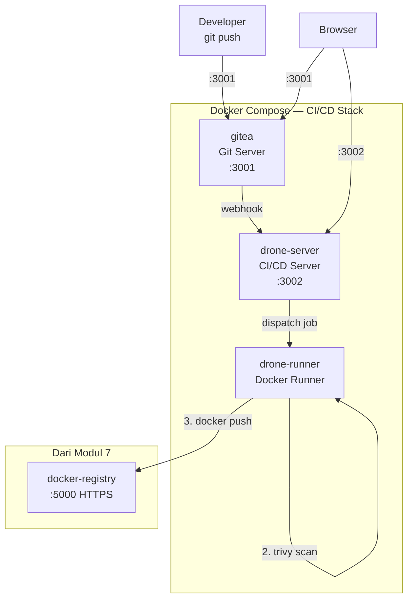

# MODUL 9: CI/CD Pipeline dengan Docker — Gitea & Drone CI

**Topik:** Deployment Gitea (Self-Hosted Git), Drone CI sebagai CI/CD Runner, dan Automasi Build → Test → Push → Deploy  
**Durasi:** 120 menit  
**Prasyarat:** Modul 7 selesai (Private Registry berjalan di `registry.lab:5000`), Modul 8 selesai (Keycloak IAM)

---

## 1. TUJUAN PEMBELAJARAN

Setelah praktikum ini, mahasiswa mampu:

1. Memahami konsep CI/CD (Continuous Integration / Continuous Deployment) dan manfaatnya
2. Men-deploy **Gitea** sebagai self-hosted Git server dalam container Docker
3. Men-deploy **Drone CI** sebagai CI/CD platform yang terintegrasi dengan Gitea
4. Menulis pipeline file (`.drone.yml`) untuk automasi build, test, scan, push, dan deploy
5. Mengkonfigurasi webhook antara Gitea dan Drone agar pipeline otomatis berjalan saat push
6. Mengintegrasikan Trivy image scanning (Modul 7) ke dalam pipeline CI/CD
7. Melakukan push image otomatis ke private registry (Modul 7) setelah pipeline berhasil
8. Memahami workflow DevOps: Code → Commit → Build → Test → Scan → Push → Deploy

---

## 2. DASAR TEORI

### 2.1 Apa itu CI/CD?

**Continuous Integration (CI)** adalah praktik menggabungkan kode dari semua developer ke repository bersama secara frequent, di mana setiap integrasi diverifikasi oleh build dan test otomatis.

**Continuous Deployment (CD)** adalah ekstensi dari CI di mana kode yang lolos semua test secara otomatis di-deploy ke environment production.

```
Developer          Git Server         CI/CD Runner         Registry        Production
   │                   │                   │                  │                │
   │── git push ──────►│                   │                  │                │
   │                   │── webhook ───────►│                  │                │
   │                   │                   │── Build Image ──►│                │
   │                   │                   │── Run Tests      │                │
   │                   │                   │── Scan (Trivy)   │                │
   │                   │                   │── Push Image ───►│                │
   │                   │                   │── Deploy ────────┼───────────────►│
   │                   │                   │                  │                │
   │◄── Notifikasi ────┤◄── Status ────────┤                  │                │
   │    (pass/fail)    │                   │                  │                │
```

### 2.2 Gitea

**Gitea** adalah self-hosted Git service yang ringan, ditulis dalam Go. Gitea menyediakan fitur mirip GitHub/GitLab: repository management, pull request, issue tracker, webhook, dan OAuth2. Sangat cocok untuk lab karena resource-nya minimal (satu binary, ~100MB RAM).

### 2.3 Drone CI

**Drone CI** adalah CI/CD platform berbasis container. Setiap step di pipeline Drone berjalan di container terpisah, sehingga environment build selalu bersih dan reproducible. Drone terdiri dari dua komponen:

| Komponen | Fungsi |
|---|---|
| **Drone Server** | Web UI, manajemen pipeline, integrasi Git via webhook |
| **Drone Runner** | Eksekusi pipeline step di container Docker |

### 2.4 Pipeline `.drone.yml`

Pipeline Drone didefinisikan dalam file `.drone.yml` di root repository. Setiap `step` berjalan di container Docker terpisah:

```yaml
kind: pipeline
type: docker
name: build-and-deploy

steps:
  - name: build
    image: docker
    commands:
      - docker build -t myapp .

  - name: test
    image: myapp
    commands:
      - python -m pytest

  - name: deploy
    image: docker
    commands:
      - docker push registry.lab:5000/myapp
```

### 2.5 Arsitektur Lab

```
┌─────────────────────────────────────────────────────────┐
│                  Docker Host                             │
│                                                          │
│  ┌──────────┐    webhook     ┌──────────────────────┐   │
│  │  Gitea   │───────────────►│    Drone Server      │   │
│  │  :3001   │                │    :3002              │   │
│  └──────────┘                └──────────┬───────────┘   │
│       ▲                                 │               │
│       │ git push                        │ dispatch      │
│       │                                 ▼               │
│  ┌──────────┐                ┌──────────────────────┐   │
│  │Developer │                │   Drone Runner       │   │
│  │          │                │   (Docker executor)  │   │
│  └──────────┘                └──────────┬───────────┘   │
│                                         │               │
│                    ┌────────────────────┬┘               │
│                    ▼                    ▼                │
│             ┌──────────┐        ┌──────────────┐        │
│             │  Trivy   │        │ Private      │        │
│             │  (scan)  │        │ Registry     │        │
│             └──────────┘        │ :5000        │        │
│                                 └──────────────┘        │
└─────────────────────────────────────────────────────────┘
```

---

## 3. TOPOLOGI LAB



---

## 4. LANGKAH PRAKTIKUM

### Langkah 0: Persiapan

```bash
mkdir -p ~/docker-lab/cicd/{drone,app-repo}
cd ~/docker-lab/cicd
```

**Pastikan** Private Registry dari Modul 7 masih berjalan:

```bash
curl -k -u admin:registry123 https://registry.lab:5000/v2/_catalog
# Harus menampilkan daftar image
```

Jika registry belum running, jalankan ulang:

```bash
cd ~/docker-lab/security
docker compose -f docker-compose.registry.yml up -d
cd ~/docker-lab/cicd
```

---

### Langkah 1: Generate Drone Shared Secret

```bash
# Generate random secret untuk komunikasi Drone Server ↔ Runner
openssl rand -hex 16 > drone/.drone_rpc_secret
cat drone/.drone_rpc_secret
```

---

### Langkah 2: Docker Compose — Gitea + Drone CI

```bash
cat > docker-compose.yml << 'EOF'
services:

  # ============================================
  # GIT SERVER: Gitea
  # ============================================
  gitea:
    image: gitea/gitea:latest
    container_name: gitea
    environment:
      - USER_UID=1000
      - USER_GID=1000
      # Database (SQLite untuk lab, production pakai PostgreSQL)
      - GITEA__database__DB_TYPE=sqlite3
      # Server
      - GITEA__server__DOMAIN=localhost
      - GITEA__server__SSH_DOMAIN=localhost
      - GITEA__server__ROOT_URL=http://localhost:3001
      - GITEA__server__HTTP_PORT=3001
      # Webhook: izinkan localhost (karena Drone di host yang sama)
      - GITEA__webhook__ALLOWED_HOST_LIST=*
      - GITEA__webhook__SKIP_TLS_VERIFY=true
    ports:
      - "3001:3001"
      - "2222:22"
    volumes:
      - gitea-data:/data
    networks:
      - cicd-net
    restart: unless-stopped

  # ============================================
  # CI/CD SERVER: Drone
  # ============================================
  drone-server:
    image: drone/drone:latest
    container_name: drone-server
    environment:
      # Gitea integration
      - DRONE_GITEA_SERVER=http://gitea:3001
      - DRONE_GITEA_CLIENT_ID=${DRONE_GITEA_CLIENT_ID}
      - DRONE_GITEA_CLIENT_SECRET=${DRONE_GITEA_CLIENT_SECRET}
      # Server config
      - DRONE_RPC_SECRET=${DRONE_RPC_SECRET}
      - DRONE_SERVER_HOST=localhost:3002
      - DRONE_SERVER_PROTO=http
      - DRONE_USER_CREATE=username:pens-admin,admin:true
      # Database
      - DRONE_DATABASE_DRIVER=sqlite3
      - DRONE_DATABASE_DATASOURCE=/data/database.sqlite
    ports:
      - "3002:80"
    volumes:
      - drone-data:/data
    networks:
      - cicd-net
    depends_on:
      - gitea
    restart: unless-stopped

  # ============================================
  # CI/CD RUNNER: Drone Docker Runner
  # ============================================
  drone-runner:
    image: drone/drone-runner-docker:latest
    container_name: drone-runner
    environment:
      - DRONE_RPC_PROTO=http
      - DRONE_RPC_HOST=drone-server
      - DRONE_RPC_SECRET=${DRONE_RPC_SECRET}
      - DRONE_RUNNER_CAPACITY=2
      - DRONE_RUNNER_NAME=local-runner
      # Trusted mode: izinkan mount volume host
      - DRONE_RUNNER_VOLUMES=/var/run/docker.sock:/var/run/docker.sock
    volumes:
      - /var/run/docker.sock:/var/run/docker.sock
    networks:
      - cicd-net
    depends_on:
      - drone-server
    restart: unless-stopped

volumes:
  gitea-data:
  drone-data:

networks:
  cicd-net:
EOF
```

---

### Langkah 3: Setup Gitea dan OAuth App

#### 3.1 Start Gitea terlebih dahulu

```bash
# Buat .env awal (Drone secrets diisi nanti)
cat > .env << 'EOF'
DRONE_RPC_SECRET=placeholder
DRONE_GITEA_CLIENT_ID=placeholder
DRONE_GITEA_CLIENT_SECRET=placeholder
EOF

# Set RPC secret dari file yang sudah digenerate
RPC_SECRET=$(cat drone/.drone_rpc_secret)
sed -i "s/DRONE_RPC_SECRET=placeholder/DRONE_RPC_SECRET=${RPC_SECRET}/" .env

# Start Gitea dulu
docker compose up -d gitea

# Tunggu Gitea ready
sleep 10
echo "Gitea ready: http://localhost:3001"
```

#### 3.2 Setup Gitea via browser

1. Buka `http://localhost:3001`
2. Pada halaman **Initial Configuration**, klik **Install Gitea** (default SQLite OK untuk lab)
3. Klik **Register** — buat akun pertama:
   - Username: `pens-admin`
   - Email: `admin@pens.ac.id`
   - Password: `admin123`
4. Login sebagai `pens-admin`

#### 3.3 Buat OAuth2 Application di Gitea (untuk Drone)

1. Klik avatar → **Settings** → **Applications**
2. Di bagian **Manage OAuth2 Applications**, isi:
   - Application Name: `Drone CI`
   - Redirect URI: `http://localhost:3002/login`
3. Klik **Create Application**
4. **Catat** `Client ID` dan `Client Secret` yang ditampilkan

#### 3.4 Update `.env` dengan OAuth credentials

```bash
# Ganti placeholder dengan nilai dari Gitea
# Contoh (gunakan nilai sebenarnya dari langkah 3.3):
sed -i "s/DRONE_GITEA_CLIENT_ID=placeholder/DRONE_GITEA_CLIENT_ID=XXXXXXXX-XXXX-XXXX-XXXX-XXXXXXXXXXXX/" .env
sed -i "s/DRONE_GITEA_CLIENT_SECRET=placeholder/DRONE_GITEA_CLIENT_SECRET=gto_XXXXXXXXXXXXXXXXXXXXXXXXXXXXXXXXXXXXXXXXXXXX/" .env

# Verifikasi
cat .env
```

#### 3.5 Start full stack

```bash
docker compose up -d
docker compose ps

# Verifikasi Drone: buka http://localhost:3002
# Drone akan redirect ke Gitea untuk OAuth login
# Login dengan akun pens-admin → Authorize → kembali ke Drone
```

---

### Langkah 4: Buat Repository dan Flask App

#### 4.1 Buat repository di Gitea

1. Di Gitea (`http://localhost:3001`), klik **+** → **New Repository**
2. Repository Name: `flask-demo`
3. Visibility: Private
4. Initialize: centang **Initialize this repository**
5. Klik **Create Repository**

#### 4.2 Clone repository dan buat aplikasi

```bash
cd ~/docker-lab/cicd/app-repo

# Clone dari Gitea (port SSH 2222)
git clone http://localhost:3001/pens-admin/flask-demo.git
cd flask-demo

# Konfigurasi git
git config user.name "PENS Admin"
git config user.email "admin@pens.ac.id"
```

#### 4.3 Buat Flask application

```bash
cat > requirements.txt << 'EOF'
flask==3.1.*
pytest==8.*
EOF

cat > app.py << 'PYEOF'
"""Flask Demo App untuk CI/CD Pipeline Lab."""
import os, socket, datetime
from flask import Flask, jsonify

app = Flask(__name__)
VERSION = os.environ.get("APP_VERSION", "1.0.0")

@app.route("/")
def index():
    return jsonify({
        "app": "flask-demo",
        "version": VERSION,
        "hostname": socket.gethostname(),
        "timestamp": datetime.datetime.now().isoformat(),
        "message": "Deployed via CI/CD Pipeline! 🚀"
    })

@app.route("/health")
def health():
    return jsonify({"status": "healthy", "version": VERSION})

def add(a, b):
    """Fungsi sederhana untuk unit test."""
    return a + b

def multiply(a, b):
    """Fungsi sederhana untuk unit test."""
    return a * b

if __name__ == "__main__":
    app.run(host="0.0.0.0", port=5000)
PYEOF
```

#### 4.4 Buat unit test

```bash
cat > test_app.py << 'PYEOF'
"""Unit tests untuk Flask Demo App."""
import pytest
from app import app, add, multiply

@pytest.fixture
def client():
    app.config["TESTING"] = True
    with app.test_client() as c:
        yield c

def test_index(client):
    """Test endpoint / mengembalikan JSON valid."""
    response = client.get("/")
    assert response.status_code == 200
    data = response.get_json()
    assert data["app"] == "flask-demo"
    assert "version" in data
    assert "hostname" in data

def test_health(client):
    """Test endpoint /health."""
    response = client.get("/health")
    assert response.status_code == 200
    data = response.get_json()
    assert data["status"] == "healthy"

def test_add():
    """Test fungsi add."""
    assert add(2, 3) == 5
    assert add(-1, 1) == 0
    assert add(0, 0) == 0

def test_multiply():
    """Test fungsi multiply."""
    assert multiply(3, 4) == 12
    assert multiply(-2, 5) == -10
    assert multiply(0, 100) == 0
PYEOF
```

#### 4.5 Buat Dockerfile (secured, dari Modul 7)

```bash
cat > Dockerfile << 'EOF'
# --- Stage 1: Dependencies ---
FROM python:3.11-slim AS builder
WORKDIR /build
COPY requirements.txt .
RUN pip install --no-cache-dir --prefix=/install -r requirements.txt

# --- Stage 2: Production ---
FROM python:3.11-slim
LABEL maintainer="admin@pens.ac.id"
LABEL version="${APP_VERSION:-1.0.0}"
LABEL description="Flask Demo — Built by Drone CI"

RUN groupadd -r appuser && useradd -r -g appuser -d /app -s /sbin/nologin appuser
COPY --from=builder /install /usr/local
WORKDIR /app
COPY --chown=appuser:appuser app.py .
USER appuser
EXPOSE 5000
HEALTHCHECK --interval=30s --timeout=5s --retries=3 \
    CMD python -c "import urllib.request; urllib.request.urlopen('http://localhost:5000/health')" || exit 1
CMD ["python", "app.py"]
EOF
```

#### 4.6 Buat `.dockerignore`

```bash
cat > .dockerignore << 'EOF'
.git
.drone.yml
test_app.py
__pycache__
*.pyc
.env
*.md
Dockerfile*
.dockerignore
EOF
```

---

### Langkah 5: Buat Pipeline `.drone.yml`

```bash
cat > .drone.yml << 'EOF'
# ============================================
# Drone CI/CD Pipeline — Flask Demo App
# ============================================
# Pipeline ini berjalan otomatis setiap git push.
# Alur: Build → Test → Scan → Push → Deploy
# ============================================

kind: pipeline
type: docker
name: flask-demo-pipeline

# ============================================
# STEP 1: Unit Test
# ============================================
steps:
  - name: unit-test
    image: python:3.11-slim
    commands:
      - pip install --no-cache-dir -r requirements.txt
      - python -m pytest test_app.py -v --tb=short
      - echo "✅ All tests passed!"

# ============================================
# STEP 2: Build Docker Image
# ============================================
  - name: build-image
    image: docker:dind
    volumes:
      - name: docker-socket
        path: /var/run/docker.sock
    environment:
      APP_VERSION: "${DRONE_TAG:-${DRONE_COMMIT_SHA:0:8}}"
    commands:
      - echo "Building image with tag $APP_VERSION..."
      - docker build -t flask-demo:${DRONE_COMMIT_SHA:0:8} .
      - docker tag flask-demo:${DRONE_COMMIT_SHA:0:8} flask-demo:latest
      - docker images | grep flask-demo
      - echo "✅ Image built successfully!"

# ============================================
# STEP 3: Security Scan (Trivy)
# ============================================
  - name: security-scan
    image: aquasec/trivy:latest
    volumes:
      - name: docker-socket
        path: /var/run/docker.sock
    commands:
      - echo "Scanning image for vulnerabilities..."
      - trivy image --severity HIGH,CRITICAL --exit-code 0 flask-demo:${DRONE_COMMIT_SHA:0:8}
      - echo "✅ Security scan completed!"
    # exit-code 0: scan report saja, tidak gagalkan pipeline
    # Ganti ke --exit-code 1 untuk block deployment jika ada CVE HIGH/CRITICAL

# ============================================
# STEP 4: Push ke Private Registry
# ============================================
  - name: push-to-registry
    image: docker:dind
    volumes:
      - name: docker-socket
        path: /var/run/docker.sock
    environment:
      REGISTRY_USER:
        from_secret: registry_user
      REGISTRY_PASS:
        from_secret: registry_pass
    commands:
      - echo "Pushing to private registry..."
      - docker login registry.lab:5000 -u $REGISTRY_USER -p $REGISTRY_PASS
      - docker tag flask-demo:${DRONE_COMMIT_SHA:0:8} registry.lab:5000/pens/flask-demo:${DRONE_COMMIT_SHA:0:8}
      - docker tag flask-demo:${DRONE_COMMIT_SHA:0:8} registry.lab:5000/pens/flask-demo:latest
      - docker push registry.lab:5000/pens/flask-demo:${DRONE_COMMIT_SHA:0:8}
      - docker push registry.lab:5000/pens/flask-demo:latest
      - echo "✅ Image pushed to registry!"

# ============================================
# STEP 5: Deploy (Update Running Container)
# ============================================
  - name: deploy
    image: docker:dind
    volumes:
      - name: docker-socket
        path: /var/run/docker.sock
    commands:
      - echo "Deploying new version..."
      - docker pull registry.lab:5000/pens/flask-demo:latest
      - docker stop flask-production 2>/dev/null || true
      - docker rm flask-production 2>/dev/null || true
      - >
        docker run -d
        --name flask-production
        --restart unless-stopped
        -p 5050:5000
        -e APP_VERSION=${DRONE_COMMIT_SHA:0:8}
        registry.lab:5000/pens/flask-demo:latest
      - sleep 3
      - docker ps | grep flask-production
      - echo "✅ Deployment complete! App running on port 5050"

# ============================================
# STEP 6: Smoke Test (Post-Deploy Verification)
# ============================================
  - name: smoke-test
    image: curlimages/curl:latest
    commands:
      - echo "Running smoke tests..."
      - "curl -sf http://host.docker.internal:5050/health || curl -sf http://172.17.0.1:5050/health"
      - echo "✅ Smoke test passed!"
    # Catatan: host.docker.internal mungkin tidak tersedia di semua setup Linux
    # Alternatif: gunakan IP gateway Docker bridge (172.17.0.1)

# ============================================
# Volumes
# ============================================
volumes:
  - name: docker-socket
    host:
      path: /var/run/docker.sock

# ============================================
# Trigger: hanya pada push ke branch main
# ============================================
trigger:
  branch:
    - main
  event:
    - push
    - tag
EOF
```

---

### Langkah 6: Konfigurasi Drone dan Aktivasi Repository

#### 6.1 Login ke Drone UI

1. Buka `http://localhost:3002`
2. Drone akan redirect ke Gitea OAuth → login dengan `pens-admin` / `admin123`
3. Authorize aplikasi Drone

#### 6.2 Aktivasi repository

1. Di Drone dashboard, klik **Sync** (pojok kanan atas) untuk sync repository dari Gitea
2. Cari `pens-admin/flask-demo` → klik **Activate**
3. Drone otomatis membuat webhook di Gitea

#### 6.3 Tambahkan Secrets di Drone

1. Di Drone, buka repository `flask-demo` → **Settings** → **Secrets**
2. Tambahkan secret:
   - Name: `registry_user`, Value: `admin`
   - Name: `registry_pass`, Value: `registry123`
3. Klik **Save** untuk masing-masing

#### 6.4 Konfigurasi repository sebagai Trusted

```bash
# Drone CLI (opsional — bisa juga via UI)
# Jika Drone CLI tersedia:
# export DRONE_SERVER=http://localhost:3002
# export DRONE_TOKEN=<token-dari-drone-ui>
# drone repo update --trusted pens-admin/flask-demo
```

Atau di Drone UI: Settings → Project Settings → centang **Trusted** (jika tersedia).

---

### Langkah 7: Push Code dan Trigger Pipeline

#### 7.1 Commit dan push

```bash
cd ~/docker-lab/cicd/app-repo/flask-demo

git add -A
git commit -m "feat: initial Flask app with CI/CD pipeline"
git push origin main
```

Masukkan credentials Gitea (`pens-admin` / `admin123`) saat diminta.

#### 7.2 Monitor pipeline di Drone UI

1. Buka `http://localhost:3002`
2. Klik repository `flask-demo` → terlihat pipeline running
3. Klik pipeline number untuk melihat log setiap step:
   - **unit-test** → output pytest
   - **build-image** → Docker build log
   - **security-scan** → Trivy scan results
   - **push-to-registry** → push ke registry.lab:5000
   - **deploy** → container `flask-production` running
   - **smoke-test** → health check passed

#### 7.3 Verifikasi deployment

```bash
# Cek container production
docker ps | grep flask-production

# Test endpoint
curl http://localhost:5050/ | python3 -m json.tool
curl http://localhost:5050/health | python3 -m json.tool

# Verifikasi image di registry
curl -k -u admin:registry123 https://registry.lab:5000/v2/pens/flask-demo/tags/list \
    | python3 -m json.tool
```

---

### Langkah 8: Test CI/CD Workflow — Update dan Re-deploy

#### 8.1 Modifikasi aplikasi

```bash
cd ~/docker-lab/cicd/app-repo/flask-demo

# Tambah endpoint baru
cat >> app.py << 'PYEOF'

@app.route("/api/info")
def info():
    """Endpoint baru — ditambahkan via CI/CD."""
    return jsonify({
        "lab": "Docker Practicum PENS",
        "module": "Modul 8 — CI/CD Pipeline",
        "deployed_by": "Drone CI",
        "pipeline": "auto"
    })
PYEOF

# Tambah test untuk endpoint baru
cat >> test_app.py << 'PYEOF'

def test_info(client):
    """Test endpoint /api/info."""
    response = client.get("/api/info")
    assert response.status_code == 200
    data = response.get_json()
    assert data["lab"] == "Docker Practicum PENS"
    assert data["deployed_by"] == "Drone CI"
PYEOF
```

#### 8.2 Commit dan push — pipeline otomatis jalan

```bash
git add -A
git commit -m "feat: tambah endpoint /api/info"
git push origin main
```

#### 8.3 Monitor di Drone UI

Buka `http://localhost:3002` → pipeline baru otomatis berjalan → tunggu sampai semua step hijau.

#### 8.4 Verifikasi update

```bash
# Endpoint baru harus tersedia tanpa manual deploy
curl http://localhost:5050/api/info | python3 -m json.tool
```

---

### Langkah 9: Simulasi Pipeline Gagal

#### 9.1 Buat test yang gagal

```bash
cd ~/docker-lab/cicd/app-repo/flask-demo

# Tambah test yang SENGAJA gagal
cat >> test_app.py << 'PYEOF'

def test_intentional_failure():
    """Test ini SENGAJA dibuat gagal untuk demo pipeline failure."""
    assert 1 == 2, "Intentional failure for CI/CD demo"
PYEOF

git add -A
git commit -m "test: tambah failing test (demo pipeline failure)"
git push origin main
```

#### 9.2 Observasi di Drone UI

1. Buka Drone → pipeline baru berjalan
2. Step **unit-test** akan **GAGAL** (merah)
3. Step selanjutnya (build, scan, push, deploy) **TIDAK DIJALANKAN**
4. Deployment TIDAK terjadi — aplikasi tetap versi sebelumnya yang masih benar

#### 9.3 Fix dan re-push

```bash
# Hapus test yang gagal
head -n -4 test_app.py > test_app_fixed.py
mv test_app_fixed.py test_app.py

git add -A
git commit -m "fix: hapus failing test"
git push origin main
```

Pipeline akan berjalan lagi dan kali ini berhasil sampai deploy.

---

## 5. PERTANYAAN

### Pre-Lab

1. Jelaskan perbedaan antara Continuous Integration dan Continuous Deployment.
2. Apa keuntungan menjalankan setiap step CI/CD di container terpisah?
3. Mengapa webhook lebih efisien daripada polling untuk trigger pipeline?
4. Apa risiko keamanan dari mount `/var/run/docker.sock` ke container CI/CD?
5. Mengapa image scanning (Trivy) penting dilakukan di dalam pipeline sebelum push ke registry?

### Post-Lab

1. Berapa total waktu eksekusi pipeline dari push sampai deploy selesai? Step mana yang paling lama?
2. Saat test gagal, step apa saja yang tetap dijalankan dan yang di-skip? Mengapa ini penting?
3. Setelah dua kali push, berapa tag yang ada di registry untuk `pens/flask-demo`? Tunjukkan output-nya.
4. Jelaskan bagaimana Drone mendapatkan notifikasi dari Gitea saat ada push baru (mekanisme webhook).
5. Jika `--exit-code 1` digunakan di step Trivy dan ditemukan CVE CRITICAL, apa yang terjadi pada pipeline? Apakah deployment tetap dilakukan?

---

## 6. CHECKLIST

- [ ] Gitea running dan bisa diakses — `http://localhost:3001`
- [ ] Akun `pens-admin` terdaftar dan bisa login
- [ ] OAuth Application untuk Drone dibuat di Gitea
- [ ] Drone Server running — `http://localhost:3002`
- [ ] Drone Runner running — `docker compose ps` menampilkan 3 service
- [ ] Repository `flask-demo` aktif di Drone
- [ ] Secrets `registry_user` dan `registry_pass` tersimpan di Drone
- [ ] Push pertama: pipeline berjalan dan semua step **hijau**
- [ ] Step **unit-test** — semua pytest pass
- [ ] Step **build-image** — image berhasil di-build
- [ ] Step **security-scan** — Trivy scan selesai, CVE terlihat
- [ ] Step **push-to-registry** — image ada di `registry.lab:5000`
- [ ] Step **deploy** — container `flask-production` running di port 5050
- [ ] `curl localhost:5050/` — menampilkan response JSON
- [ ] Push kedua (update kode): pipeline otomatis berjalan, endpoint baru tersedia
- [ ] Push ketiga (failing test): pipeline GAGAL di unit-test, deploy TIDAK terjadi
- [ ] Push keempat (fix): pipeline kembali berhasil

---

## 7. TABEL TROUBLESHOOTING

| **Gejala** | **Kemungkinan Cause** | **Solusi** |
|---|---|---|
| Drone redirect loop saat login | OAuth Client ID/Secret salah | Buat ulang OAuth App di Gitea, update `.env`, restart Drone |
| Repository tidak muncul di Drone | Belum sync | Klik **Sync** di Drone dashboard |
| Pipeline tidak trigger saat push | Webhook belum terbuat atau URL salah | Cek di Gitea: Settings → Webhooks, pastikan URL `http://drone-server/hook` |
| Step `docker build` error `permission denied` | Docker socket tidak di-mount | Pastikan `volumes: docker-socket` di `.drone.yml` dan `DRONE_RUNNER_VOLUMES` di compose |
| `docker login` gagal di pipeline | Secrets belum ditambahkan di Drone | Tambah `registry_user` dan `registry_pass` di Drone → Repository → Settings → Secrets |
| Trivy scan timeout | Download vulnerability DB pertama kali lambat | Tambah `--timeout 10m` pada command Trivy |
| Deploy gagal: `port already in use` | Container lama masih ada | Pipeline sudah handle `docker stop/rm`, cek manual apakah ada container lain di port 5050 |
| Smoke test gagal `curl: connection refused` | Container belum fully started atau host network tidak reachable | Naikkan `sleep` di step deploy, gunakan IP gateway Docker `172.17.0.1` |
| `git push` authentication failed | Username/password Gitea salah | Gunakan `pens-admin` / `admin123` |
| Pipeline jalan tapi step kosong | `.drone.yml` tidak ada di repository | Pastikan file sudah di-commit dan di-push |

---

## 8. FORMAT LAPORAN

Submit via LMS dalam **satu file PDF (max 8 halaman)**:

**Halaman 1:** Cover

**Halaman 2–6:** Screenshot Wajib (14 screenshot):
1. Gitea — repository `flask-demo` berisi file source code
2. Gitea — Settings → Webhooks → Drone webhook aktif
3. Drone UI — repository `flask-demo` ter-aktivasi
4. Drone — Secrets page (nama secret terlihat, value tersembunyi)
5. Pipeline pertama — overview semua step **hijau** (passed)
6. Pipeline step **unit-test** — log output pytest
7. Pipeline step **build-image** — log Docker build
8. Pipeline step **security-scan** — log output Trivy
9. Pipeline step **push-to-registry** — log push berhasil
10. Pipeline step **deploy** — log container running
11. `curl localhost:5050/` — response JSON aplikasi yang di-deploy
12. Pipeline kedua (update) — semua step hijau, endpoint baru tersedia
13. Pipeline ketiga (failing test) — step unit-test **merah**, step selanjutnya di-skip
14. `curl -k https://registry.lab:5000/v2/pens/flask-demo/tags/list` — multiple tags

**Halaman 7–8:** Jawaban Post-Lab

---

## 9. REFERENSI

1. Gitea Contributors. (2025). Gitea Documentation. https://docs.gitea.com/
2. Harness, Inc. (2025). Drone CI Documentation. https://docs.drone.io/
3. Harness, Inc. (2025). Drone Pipeline Configuration. https://docs.drone.io/pipeline/docker/overview/
4. Aqua Security. (2025). Trivy CI/CD Integration. https://trivy.dev/latest/tutorials/integrations/
5. Docker, Inc. (2025). Docker-in-Docker (DinD). https://hub.docker.com/_/docker
6. Fowler, M. (2006). Continuous Integration. https://martinfowler.com/articles/continuousIntegration.html
7. Humble, J. & Farley, D. (2010). *Continuous Delivery*. Addison-Wesley.

---

> **Durasi:** 120 menit | **Difficulty:** Advanced  
> **Previous:** Modul 8 — Keycloak Identity & Access Management  
> **Seri Selesai:** Modul 1–9 Docker Practicum Series — PENS
